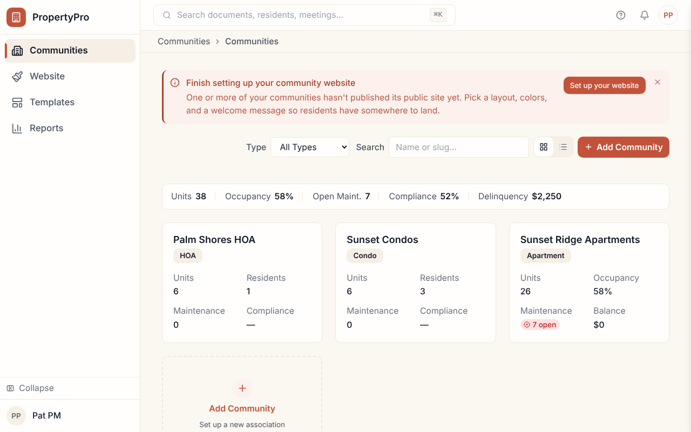
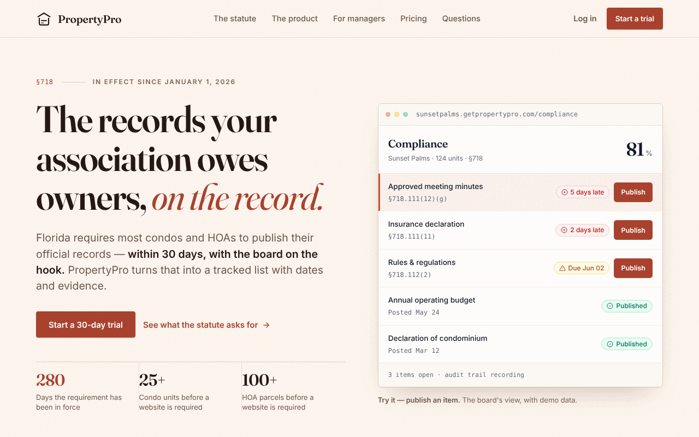
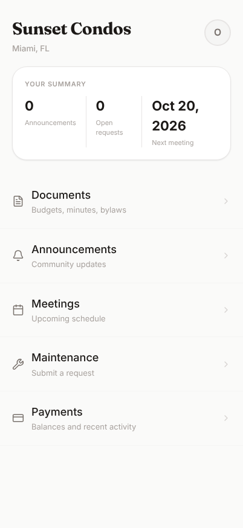

# PropertyPro Florida

**A multi-tenant web platform that helps Florida condo associations, HOAs and
apartment communities keep the records state law requires them to publish —
with deadlines, statute citations and an audit trail.**

**Live site:** <https://property-pro-web.vercel.app> — the public marketing
site, including an interactive compliance panel with demo data. The portal
itself needs an account.

**Status:** pre-launch hardening. E-voting is gated on attorney review. There is
no native mobile app (residents use web routes under `/mobile`). PropertyPro
does not provide legal, engineering or financial advice.

**Stack:** Next.js 15 (App Router) · React 19 · TypeScript · Supabase (Postgres
+ row-level security, Auth, Storage) · Drizzle ORM · Tailwind CSS + shadcn/ui ·
TanStack Query · Stripe · Resend · Vercel · Turborepo + pnpm

- **Statutory records tracking** for condos (§718.111(12)(g)) and HOAs
  (§720.303): a required-records queue with deadlines, statute citations,
  owner-portal visibility and a readiness score.
- **One product, three audiences** — a community portal for boards and
  managers, a mobile-web view for residents, and a dashboard for property
  managers who run several communities.
- **Day-to-day operations** around the records: documents, meetings,
  announcements, maintenance requests and Stripe billing.
- **Tenant isolation enforced in four layers**, not by convention: a scoped
  database client, a CI import guard, `FORCE ROW LEVEL SECURITY`, and a write
  trigger that rejects unscoped mutations.
- **An operator console** (`apps/admin`) for support tickets, service health,
  billing and onboarding.

Guardrails, measured 2026-10-08: 34 repository-specific lint guards
(`scripts/run-lint-guards.mjs`) and 1,461 test files.

## Screenshots

Captured from the local agent sandbox (`pnpm agent:live:web`) with the seeded
demo communities and `*.local` demo personas. No production data.

**Compliance** — the required-records queue for a §718 condo, as its root
manager sees it.


**Property-manager portfolio** — every community the manager runs, with
cross-community totals.



<table>
<tr>
<td width="68%"></td>
<td></td>
</tr>
<tr>
<td><b>Public site</b> — what the live link shows</td>
<td><b>Resident view</b> (<code>/mobile</code>)</td>
</tr>
</table>

## Overview

PropertyPro helps condo associations, HOAs, and apartments meet Florida statutory requirements (§718 / §720) for document posting, meeting notices, and owner portal access.

## Apps

| App | Port | Domain | Description |
|-----|------|--------|-------------|
| `apps/web` | 3000 | `[slug].getpropertypro.com` | Community portal (resident, board, PM) |
| `apps/admin` | 3001 | `admin.getpropertypro.com` | Operator console (platform admin only) |

## Local Development

### First-time setup

```bash
# 1. Copy environment variables
cp .env.example .env.local
# Fill in your Supabase, Stripe, Resend, and Sentry values

# 2. Run setup (creates .env.local symlinks for each app)
./scripts/setup.sh

# 3. Install dependencies
pnpm install

# 4. Start the supported local agent sandbox (Supabase Auth + Storage + DB).
#    It never reads .env.local and refuses remote backends.
pnpm agent:env:prepare
```

> **Never run `pnpm --filter @propertypro/db db:migrate` from a shell carrying
> the root `.env.local`.** That file's `DATABASE_URL` is **production**.
> Migrations reach production one way only — manually, via Supabase MCP
> `apply_migration`, in the order documented in
> [docs/DEPLOYMENT.md](docs/DEPLOYMENT.md).
>
> One migration on `main` makes this concrete: `0062_secret_ballot` is an
> irreversible contract migration, deliberately unapplied pending attorney
> sign-off on e-voting. `db:migrate` would apply it and destroy the ballot
> linkage permanently.

### Running the apps

```bash
# Run everything (all apps + packages watch mode)
pnpm dev

# Run a single app
pnpm --filter @propertypro/web dev      # web on :3000
pnpm --filter @propertypro/admin dev    # admin on :3001
```

### Agent live testing

Use the sandbox when testing authenticated behavior or asking an agent to
inspect a change in a browser. It provisions an isolated local Supabase stack
per worktree, migrates it, and seeds the demo personas without reading
`.env.local`.

```bash
pnpm agent:live:web       # starts web and prints its unique localhost URL
pnpm agent:live:admin     # starts admin only when needed
pnpm agent:env:status     # show this worktree's URLs
pnpm agent:env:reset      # clean local-only DB, then migrate and reseed
pnpm agent:env:stop       # stop the worktree's stack while retaining data
```

After the web server starts, visit the printed `/dev/agent-login?as=owner`
URL. For a disposable scenario, create a namespaced fixture and open the
returned login URL:

```bash
pnpm agent:fixture:community -- --slug agent-review --name "Review HOA" --type hoa_720 --root-email root@agent.local --root-name "Root Agent"
pnpm agent:fixture:user -- --community agent-review --email resident@agent.local --name "Resident Agent" --role resident --owner
```

### Admin access

After running migrations, insert your Supabase auth UUID into `platform_admin_users`:

```sql
INSERT INTO platform_admin_users (user_id) VALUES ('YOUR-SUPABASE-AUTH-UUID-HERE');
```

Then log in at `http://localhost:3001`.

## Other Commands

```bash
pnpm typecheck          # Type-check all packages
pnpm lint               # ESLint + every guard in scripts/run-lint-guards.mjs
pnpm test               # Unit tests
pnpm build              # Production build
pnpm seed:demo          # Seed demo communities
pnpm seed:verify        # Verify seed integrity
pnpm perf:check         # Performance budget check
pnpm clean              # Clean build outputs
```

## Demo Communities

Three pre-seeded demo communities (created via `pnpm seed:demo`):

| Community | Slug | Type | City |
|-----------|------|------|------|
| Sunset Condos | `sunset-condos` | Condo §718 | Miami, FL |
| Palm Shores HOA | `palm-shores-hoa` | HOA §720 | Fort Lauderdale, FL |
| Sunset Ridge Apartments | `sunset-ridge-apartments` | Apartment | Tampa, FL |

## Documentation

See [`docs/`](./docs/) for detailed documentation:

- [`TRANSITION-PLAN-v4.1-AGENT-SPEC.md`](./docs/TRANSITION-PLAN-v4.1-AGENT-SPEC.md) — Implementation plan
- [`00-DEMO-PLATFORM-TECH-SPEC.md`](./docs/00-DEMO-PLATFORM-TECH-SPEC.md) — Full technical spec
- [`adr/`](./docs/adr/) — Architecture Decision Records
- [`design-system/`](./docs/design-system/) — Design system documentation
