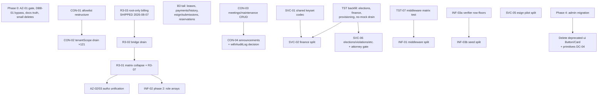

# Full-Monorepo Refactor Audit & Cleanup Roadmap

**Date**: 2026-07-18
**Author**: Claude (multi-agent refactor-audit workflow)
**Status**: Audit only — no code changes in this pass
**Scope**: Full monorepo (~2,800 files / ~390K LOC) at commit c3c973a
(`c3c973a5462431599d7f00fafd777de3fab1751e`). Findings adversarially verified;
counts re-run at HEAD.

---

## 1. Headline numbers

All figures re-measured at HEAD by the verification pass (not survey ground truth).

| Metric | Verified value | Source |
|---|---|---|
| Services layer size | 90 `.ts` files, 30,439 LOC; 13 files > 750 LOC (max: finance-service.ts 2,410) | SVC baseline |
| API routes | 256 `route.ts` under `apps/web/src/app/api/v1` (257 incl. `/api/health`) | AZ/CON/DC baselines |
| Contract-style adoption | 220/257 contracted (`runRoute`); 37-entry grandfather allowlist, ~33 of which are permanently runner-blocked | CON-01 |
| tenantScope adoption | 12 contract.ts declare it (7 query/body); 121 already-contracted routes still hand-call `resolveEffectiveCommunityId` in canonical shapes | CON-02 |
| Legacy-role residue | 73 dead legacy literals across exactly 20 allowlisted files, **zero ceiling slack**; RBAC_MATRIX still 7-role-keyed with 4 unreachable columns | R3 baseline, R3-01 |
| Authorization idioms | ≥ 9 coexisting route-level authz idioms across 5 policy sources; 1 confirmed missing gate (POST /invitations) | AZ-01/AZ-02 |
| Unbounded hard-tier endpoints | 2 remaining B3 migrations (leases; reservations resident path) + 3 endpoints never covered by the B3 doc (payments/history, esign/submissions, forum thread replies) | PAG-01…06 |
| Design-token baseline | 1,650 frozen violations / 76 files; in-scope web debt is **30 violations in 5 files**, all intentionally-frozen dark-mode variants | FE baseline |
| Hooks test ratio | 98 hook sources (84 TanStack Query), 74 dedicated test files; ~28 hooks untested | TST-04 / FE baseline |
| Integration/E2E cover | 36 web + 15 packages/db real-DB integration files; 13 Playwright specs; only 2 skipped tests repo-wide | TST baseline |
| Guard suite | 16 `guard:*` scripts chained into `pnpm lint`; 13 have no fixture tests of their own | TST-05, INF-05 |
| Dead code found | 15 orphan components (~2,139 LOC), 2 orphan hooks, 207-line orphan shared module, ~70/197 unused shared exports, 2 dead finance-service exports | DC-01…06, SVC-07 |
| Middleware | `apps/web/src/middleware.ts` = 994 lines; tenant resolution inlined 4×, `finaliseResponse` threaded 20× | INF-01 |

Verification outcome: **61 findings survived** (49 confirmed, 8 corrected in
place, 4 unchecked medium-tier), **0 rejected** across 10 dimensions. No
auditor dimension failed.

---

## 2. Executive summary

- **The architecture is sound; the debt is concentrated in file size and
  unfinished migration tails.** Tenant isolation, the contract runner, the DB
  boundary, and the guard suite are all healthy and ratcheted. Nothing found
  here suggests a rewrite; everything suggests finishing programs that are
  60–95% done.
- **Top 3 programs to finish**: (1) role-v3 residue — the RBAC_MATRIX 7→3
  collapse, Phase 4.4 bridge drain, and Phase 3.4 root-only billing (R3-01…04);
  (2) the tenantScope drain — 121 mechanical conversions with the drain-loop
  machinery already built (CON-02); (3) the B3 pagination tail — 2 real
  migrations plus 3 doc amendments, not the "10 remaining" the stale tracker
  implies (PAG-05).
- **Top 3 new items**: (1) the one real security gap — POST `/api/v1/invitations`
  has no role gate (AZ-01, S effort, fix first); (2) `/api/v1/payments/history`
  is an unbounded merged two-table feed with the fastest data growth of any
  remaining endpoint (PAG-02); (3) `createAdminClient` is re-exported from the
  root `@propertypro/db` entrypoint, bypassing every service-role import guard
  (DBB-01, S effort).
- **Refactor sequencing is dominated by test posture, not by design.** The big
  services (finance 2,410 LOC, elections 1,445, provisioning 1,350) are mocked
  wholesale by 15–17 of their referencing test files; only esign is genuinely
  characterized (17/18 exported functions, 89 direct cases). Decomposition must
  follow test backfill (TST-01/02/03, SVC-06) — esign is the safe pilot.
- **Duplication is disciplined, not chaotic**: the 7 hand-rolled cursor codecs
  all implement one written design doc and all have direct tests (SVC-01), the
  4 cron outbox workers share one shape (SVC-03), and the condo/apartment
  onboarding pair differs by ~40 normalized diff lines (FE-04). These are
  low-risk extractions, not untangling jobs.
- **Dead code is small and enumerable** (~3,000 LOC total across DC findings)
  and the repo has no unused-export tooling; a report-mode knip/ts-prune guard
  would prevent regrowth as the SVC migrations supersede old list functions.
- **Docs have drifted behind shipped reality** in two load-bearing places:
  ADR-006 still describes Phase 4.1 as deferred though it shipped, and
  migration-safety.md says "next free migration: 0026" while 0026–0028 exist
  on disk (R3-05) — a numbering-collision trap. Cheap, high-value fixes.

---

## 3. What's healthy

This section exists so the roadmap reads as "finish and polish," not "rewrite."

- **Guard suite**: 16 `guard:*` scripts wired into a single `pnpm lint`
  entrypoint (local == CI), plus no-mock and migration-ordering CI jobs. The
  three major allowlists (contracts, legacy-roles, design tokens) are all
  exactly current — zero stale slack found by independent replication of each
  guard's logic (DC healthNotes). `verify-route-table-imports.ts` and
  `verify-scoped-db-access.ts` are AST-based, detect dead allowlist entries
  (the former), and grandfather lists have been drained to zero where promised.
- **DB boundary**: tier-C routes (direct table imports) went 89 → **0** since
  the 2026-05-08 survey; tier-A (service-only) grew 114 → ~175 even as 27
  routes were added; route-layer `db/unsafe` importers shrank 42 → 10, every
  one a named purpose-built helper; `@propertypro/db/filters` imports in routes
  went 76 → 0 (DBB healthNotes).
- **Contract layer**: `withErrorHandler` coverage 251/256 with all 5 exceptions
  structurally justified; converted routes document their preserved auth chains
  in header comments; new routes adopt tenantScope without backfill pressure
  (9 → 12 since the last survey, all greenfield).
- **Drain-loop automation** (`.claude/workflows/drain-loop.workflow.js` +
  `drain-one-batch.workflow.js`) captured real institutional knowledge —
  RUNNER_BLOCKED/COMPLEX_SKIP classification, hard-tier rejection rules, a
  rebase-conflict recipe — and took the contract allowlist from 229 to 35.
  It is reusable as-is for the tenantScope program.
- **Pagination discipline**: all six hard-tier migrations landed since the B3
  design doc preserve its exact sort contracts, opaque cursors, look-ahead
  `hasMore`, and the canonical envelope; audit-trail tolerates stale cursors
  gracefully.
- **Deliberate deploy policy**: code-only `deploy.yml` with manual
  expand/contract migrations via Supabase MCP is documented, reconciled policy
  (prod ledger through 0022) and must not be "fixed" back into CI (INF
  healthNotes).
- **Already-centralized cross-cutting concerns**: audit logging
  (`packages/db/src/utils/audit-logger.ts`) and notification fan-out
  (`notification-service`) are consumed, not reimplemented, by ~20 services —
  the survey's "repeated audit/notification shape" claim was half wrong (SVC).
- **Tests where it counts**: real-Postgres integration suites drive actual
  route handlers through a shared multi-tenant test kit; RLS/scoped-client/
  isolation tests live in packages/db; only 2 `.skip` cases exist repo-wide.
- **Statutory care**: elections does ballot-cast audit inside the voting
  transaction (deliberate §718.128 atomicity), designation is read only for
  board targeting per ADR-006 §3.2, and e-voting sits behind an explicit
  attorney-review gate.

---

## 4. Findings by theme

Cross-dimension overlaps are deduped: the announcements route appears once
(CON-04, with PAG cross-reference); middleware appears once (INF-01, TST-07 as
its test prerequisite); FE-02 and DC-01 describe the same orphan hook pair and
are merged in the roadmap as one item. No findings were rejected in any
dimension (0/61); corrections are noted inline.

### 4.1 Services (SVC) — 8 findings, 0 rejected, 1 corrected

30,439 LOC across 90 files; 13 files exceed 750 LOC. The real duplication is
three specific shapes (cursor codec ×7, outbox worker ×4+, micro-helpers ×11/×5),
not general CRUD sprawl. Test posture, not architecture, is the refactor risk.

| ID | Finding | Files | Impact | Effort | Risk |
|---|---|---|---|---|---|
| SVC-01 | Ordered-cursor keyset trio duplicated 7× across 6 services — extract generic helper next to `paginate()` | finance/faq/polls/package-visitor/work-orders/operations services, packages/db/src/pagination.ts | high | M | low |
| SVC-02 | finance-service.ts (2,410 LOC) = 5 subsystems; cut the import-isolated Stripe-webhook section (584 lines) first | finance-service.ts | high | L | medium |
| SVC-03 | Email queue-worker lifecycle (claim/markSent/markFailedOrRetry) reimplemented per cron service | calendar-reminder, digest ×2, payment-alert, assessment-automation services | medium | M | medium |
| SVC-04 | `getBaseUrl` ×11 files, `isUniqueConstraintError` ×5 — env-fallback drift hazard for email links | services layer | low | S | low |
| SVC-05 | esign-service.ts (1,581 LOC) splits cleanly into templates/submissions/signing/consent; best-tested candidate | esign-service.ts | medium | M | low |
| SVC-06 | Mutation cores of elections/violations/package-visitor/work-orders have almost no direct tests — gate decomposition on TST backfill; fence elections (§718.128) | 4 services | high | M | high |
| SVC-07 | Dead exports `listAssessmentsForCommunity`/`findActorUnitId`; no dead-export tooling (corrected: mock-stub attribution swapped) | finance-service.ts | low | S | low |
| SVC-08 | Misnamed test in src/: provisioning-service.test.ts actually tests provisioning-address | src/lib/services/ | low | S | low |

Evidence (high-impact): SVC-01 — `grep -c "OrderedCursor"` → 18/9/8/9/9 across
the five services; each trio is ~60–90 lines (finance's at 67/380–441); shared
`paginate()` exists at `packages/db/src/pagination.ts:201` but has no multi-key
variant; every copy has a direct unmocked pagination test. SVC-02 — webhook
subsystem is exactly lines 1770–2353 (584 lines, `awk` count); 17 of 20 test
files mock the module wholesale, so the re-export-barrel decomposition keeps
all `vi.mock` factories working. SVC-06 — elections: 16 test refs, 15 mock it;
the sole unmocked suite exercises 1 of 16 exports (`castElectionVoteForCommunity`,
line 888).

### 4.2 Role-v3 (R3) — 7 findings, 0 rejected, 1 corrected

Phase 4.1 (contract migration 0020 + uniform `checkPermissionV2`) has **already
shipped** — the surveyed "deferred" list was stale. What genuinely remains:
the matrix collapse and the Phase 4.4 bridge drain. Guard: 73 dead literals /
20 files, zero slack.

> **Update 2026-08-07:** R3-03 (Phase 3.4 root-only billing/deletion) has
> **shipped**. Its claim-root adoption gate was retired on prod evidence: all 7
> live communities are non-customers (seed-fixture leaks + demo conversions,
> zero paying customers), and every rootless one has a `property_manager` who
> can self-claim — so there was no admin to lock out. See the ADR-006 addendum
> (2026-08-07) for the evidence, enforcement points and explicit non-scope.

| ID | Finding | Files | Impact | Effort | Risk |
|---|---|---|---|---|---|
| R3-01 | Collapse RBAC_MATRIX 7-role keying to v3 — 4 columns unreachable at the choke point; new features still author legacy rows | packages/shared/src/rbac-matrix.ts, access-policies.ts, access-control.ts | high | L | medium |
| R3-02 | Phase 4.4 bridge drain: delete `inferCanonicalRoleFromMembership` + 6 display/config call-site files (39 refs) | billing/permissions.ts, nav-config.ts, feature-registry.ts, role-guard.ts, esign-constants.ts, compliance-command-center.tsx, invitations-service.ts | medium | M | low |
| R3-03 | ✅ **SHIPPED 2026-08-07** — billing + community deletion now gate on `requireRootManager`, not settings:write (gate retired on prod evidence) | subscribe/route.ts, communities/delete/route.ts | medium | M | medium |
| R3-04 | Billing shim reads designation as a permission input (PM + board_member designation *loses* billing-admin) — ADR-006 §2 violation (corrected: causal branch) | billing/permissions.ts:36–48 | medium | S | low |
| R3-05 | ADR-006 + migration-safety.md stale: Phase 4.1 shipped; "next free migration 0026" is wrong (0026–0028 exist; next free 0029) | docs/adr/ADR-006, .claude/rules/migration-safety.md | low | S | low |
| R3-06 | Dead 7-role pg enum `userRoleEnum` still declared in Drizzle schema (0 column uses) | packages/db/src/schema/enums.ts:31–38 | low | S | low |
| R3-07 | Deprecated v1 `checkPermission` survives only for 582 lines of 7-role tests pinning the dead columns | rbac-matrix.ts:576, rbac.test.ts, rbac-parity.test.ts | low | M | low |

Evidence (high-impact): R3-01 — `checkPermissionV2`
(`apps/web/src/lib/db/access-control.ts:43-56`) reads only owner/tenant/
property_manager_admin columns; the 2026-07-17 wind-mitigation commit (065f7f4)
still added all 7 role rows for a new `insurance` resource; rbac-matrix.ts (593
lines) holds 16 of the guard's 73 dead literals. Sequencing: R3-01 depends on
R3-02/R3-03 draining the last legacy-vocabulary consumers; R3-07 folds into
R3-01's PR using the existing `generate-rbac-snapshots.ts` before/after harness.

### 4.3 Authorization (AZ) — 5 findings, 0 rejected, 1 corrected

One real gap, one structural problem (nine coexisting idioms across five policy
sources), and three consistency items. The v3 bridge (`checkPermissionV2`) is a
ready landing zone — route-level unification is NOT blocked on the vocabulary
retirement.

| ID | Finding | Files | Impact | Effort | Risk |
|---|---|---|---|---|---|
| AZ-01 | **POST /api/v1/invitations has no role gate** — any member can mint/email invitations (blast radius bounded: invitee must already exist; no privilege escalation) | invitations/route.ts | high | S | low |
| AZ-02 | ≥ 9 coexisting route-level authz idioms; policy in 5 sources (matrix, ROLE_ALIASES, ADMIN_ROLES, finance/accounting guard families, inline literals) (corrected: guard-family file paths) | access-control.ts, role-guard.ts, access-policies.ts, lib/finance/common.ts, lib/accounting/common.ts | high | L | medium |
| AZ-03 | 92 membership-only routes; 24 have session+membership as their *only* gates — member-level intent undeclared (this is how AZ-01 survived); `/upload` presign looser than its record-write | notifications, help, documents/versions, upload routes | medium | M | low |
| AZ-04 | Storage-path validation = 3 divergent patterns; maintenance-requests omits the `..` rejection (not currently exploitable — Supabase literal keys) | upload-path.ts, maintenance-requests/route.ts, site-assets/storage-paths.ts | medium | S | low |
| AZ-05 | PM cross-community lane: correct two-step gate copy-pasted per route (8 routes), no shared `requirePmPortfolioAccess` helper | lib/api/pm-communities.ts, pm/bulk/* | medium | S | low |

Evidence (high-impact): AZ-01 — route chain ends at
`requireCommunityMembership` (route.ts:52); `grep` for any authz gate returns
zero hits; RBAC_MATRIX residents.write is admin-only. AZ-02 — measured against
256 routes: requirePermission 74, requireCommunityMembership 194,
requireRole/hasRole 10, isAdminRole 4, inline `.role ===` 18,
`membership.isAdmin` 17, requireFinance\* 18, requireAccounting\* 5,
requirePlatformAdmin 7, isPmAdminInAnyCommunity 8. Sanctioned non-matrix lanes
after unification: platform-admin, cron-secret, PM portfolio (via the AZ-05
helper).

### 4.4 Contracts & tenant scope (CON) — 4 findings, 0 rejected, 1 corrected

The A1 drain succeeded (229 → 37) but has stalled at its structural floor:
observable velocity over 5 weeks is zero drains (allowlist 35 → 37 via two
legitimate cron additions), because ~33 of 37 entries are permanently
runner-blocked. The successor program is tenantScope adoption.

| ID | Finding | Files | Impact | Effort | Risk |
|---|---|---|---|---|---|
| CON-01 | Split the 37-entry allowlist into ~33 PERMANENT_EXCLUSIONS + ~4 drainable; drain `documents/drafts/[id]/publish` (no blockers) | scripts/verify-contracts.ts, drain workflows | medium | S | low |
| CON-02 | **121 contracted routes still hand-call `resolveEffectiveCommunityId` in canonical shapes; no adoption ratchet in guard:tenant-scope** | run-route.ts (app + package), verify-tenant-scope.ts | high | L | low |
| CON-03 | Legacy action-dispatch CRUD: meetings (447 LOC, 5 actions) and maintenance-requests (422 LOC, 3 actions) — no runner blockers, M apiece | meetings/route.ts, maintenance-requests/route.ts | medium | M | medium |
| CON-04 | Announcements conversion (514 LOC) blocked on unproven runRoute+withAuditLog composition; GET hard-tier ordering already encapsulated in `listVisibleAnnouncements` (PAG cross-ref — one roadmap item) | announcements/route.ts, audit-middleware.ts | medium | L | medium |

Evidence (high-impact): CON-02 — 148/256 routes hand-call the resolver; 142 of
those are already runRoute-contracted; 73 query-shape + 70 body-shape − 22
overlap = 121 unique canonical conversions. The 21 non-canonical remainder is
PM cross-community/Stripe/token-auth routes that per `api-patterns.md` should
NOT declare tenantScope. The drain-loop machinery (batching, dual review,
rebase recipe) transfers wholesale.

### 4.5 DB boundary (DBB) — 5 findings, 0 rejected, 1 corrected

Strongly positive drift since the A3 survey (see §3). Remaining items are gate
completeness, not violations.

| ID | Finding | Files | Impact | Effort | Risk |
|---|---|---|---|---|---|
| DBB-01 | **`createAdminClient` root re-export bypasses all service-role import gates** — 3 routes use it with zero allowlist entry or AUTHZ comment | packages/db/src/index.ts:39, 3 guard scripts, 3 routes | high | S | low |
| DBB-02 | Table-import guard scans only app/api — 20 server pages/non-API files import Drizzle tables directly | verify-route-table-imports.ts, 20 app files | medium | M | low |
| DBB-03 | WEB_UNSAFE_IMPORT_ALLOWLIST: 21 of 100 entries dead, no dead-entry detection (pattern exists in the sibling guard) | verify-scoped-db-access.ts | medium | S | low |
| DBB-04 | 7 AUTHZ rationale comments name retired roles (pm_admin/cam) at unsafe-boundary call sites (corrected: count 5→7) — rewrite with ADR-006 retirement, not before | site-blocks-service.ts, site-assets/quota.ts, verify-scoped-db-access.ts | low | S | low |
| DBB-05 | A3 survey doc still says "guard not yet implemented / don't enable" — guard shipped, allowlist drained to 0 | docs/audits/a3-…-2026-05-08.md | low | S | low |

Evidence (high-impact): DBB-01 — DB004 gates only the
`@propertypro/db/supabase/admin` subpath specifier; `verify-authz-comments.ts`
matches only `db/unsafe`; `verify-route-table-imports.ts` blanket-allows the
symbol (line 91). Fix: remove the root re-export, force the subpath, extend the
comment guard's regex, allowlist + annotate the 3 existing routes.

### 4.6 Pagination (PAG) — 6 findings, 0 rejected, 0 corrected

The "10 still unbounded" tracker is stale: 6 of 10 hard-tier migrations landed
faithfully. Real remaining work is small but includes the fastest-growing
unbounded endpoint in the codebase.

| ID | Finding | Files | Impact | Effort | Risk |
|---|---|---|---|---|---|
| PAG-01 | Leases GET: last fully-unbounded original hard-tier endpoint (full-table fetch + JS filters; double-fetch on `renewal_chain_for`) | leases/route.ts, lease-service.ts:45 | medium | M | medium |
| PAG-02 | **NEW: /payments/history is an unbounded merged two-table feed** (per-unit-per-cycle growth — fastest of anything remaining); never covered by the B3 doc | payments/history/route.ts, finance-service.ts:1090 | high | M | medium |
| PAG-03 | NEW: /esign/submissions unbounded with post-fetch computed-status filtering (violates B3 Decision 3) | esign/submissions/route.ts, esign-service.ts:721 | medium | M | medium |
| PAG-04 | Reservations resident path full-fetches then JS-slices (violates B3 Non-Goal 2); admin path is doc-compliant | reservations/route.ts, work-orders-service.ts:1030 | medium | S | low |
| PAG-05 | Tracker correction: calendar/events, reservations-admin, elections must NOT be counted as remaining B3 work (range-bounded / offset-sanctioned / limit-bounded by design) | b3 design doc | medium | S | low |
| PAG-06 | Forum thread detail returns ALL replies unbounded (asc createdAt) — clean future keyset, low urgency | forum/threads/[id]/route.ts, polls-service.ts:571 | low | M | low |

Evidence (high-impact): PAG-02 — `listPaymentHistoryForCommunity`
(finance-service.ts:1090) selects ALL paid assessment line items (desc paidAt,
id) and ALL rent obligations (desc updatedAt, id), merges in JS, zero `limit(`;
route has zero cursor handling. Amend the B3 doc first (merged-feed precedent:
calendar's range-bounding), do not force id-only `paginate()`.

### 4.7 Frontend & design system (FE) — 6 findings, 0 rejected, 2 corrected

In-scope web token debt is effectively zero; deprecated-component drain is 3
imports from done; the real items are one orphan-hook footgun, a naming-
convention split, one copy-paste route pair, and sequenced decomposition of 11
oversized components.

| ID | Finding | Files | Impact | Effort | Risk |
|---|---|---|---|---|---|
| FE-01 | Drain last 3 deprecated `@propertypro/ui` Button imports in web (Card at 0); lock zero with ESLint; deletion blocked by 2 admin imports | 3 compliance components, packages/ui Button/Card | medium | S | low |
| FE-02 / DC-01 | Duplicate `useComplianceChecklist` hooks with different fetch semantics; the richer documented one (82 lines + 255-line test) is an orphan (corrected: quote-agnostic grep) | hooks/use-compliance-checklist.ts vs useComplianceChecklist.ts | medium | S | low |
| FE-03 | Hook filename split: 90 kebab vs 8 camelCase in one dir — the collision surface that produced FE-02; rename + filename lint | 8 camelCase hooks | low | S | low |
| FE-04 | Condo/apartment onboarding: routes 257 LOC each, ~40 normalized diff lines; hooks 46 each, diff 8. Extract factory; wizards genuinely diverge — leave them | onboarding/{condo,apartment}/route.ts + hooks | medium | M | medium |
| FE-05 | 9 components > 500 LOC (max 722) + 2 app-dir clients (699/634); RolesAccessClient's *data hook* carries a legacy-filter workaround — soft-sequence with R3 (corrected: component itself is pure v3) | assessment-manager, RolesAccessClient, CommandPalette, signup-form, esign trio, … | medium | L | medium |
| FE-06 | Two small request/nav utils copy-pasted web↔admin with content drift — fold into packages/shared opportunistically | forwarded-headers.ts ×2, navigation-progress-event.ts ×2 | low | S | low |

### 4.8 Testing (TST) — 8 findings, 0 rejected, 1 corrected, 4 unchecked

The gating theme of the whole roadmap: mock-heavy topology around exactly the
services SVC wants to decompose. The surveyed "163 hooks, ~9 tests" was wrong
(98 sources / 74 tests); the guard suite itself is largely untested.

| ID | Finding | Files | Impact | Effort | Risk |
|---|---|---|---|---|---|
| TST-01 | elections-service effectively uncharacterized: 1 of 16 exports exercised unmocked (3 cases); §718.128 territory — backfill before any decomposition | elections-service.ts, vote-integration.test.ts | high | M | low |
| TST-02 | finance-service: 5 of 30 exports directly tested (31 cases in 3 files); 17/20 test files mock it wholesale | finance-service.ts | high | L | low |
| TST-03 | provisioning-service: 4/16 exports tested, mock-heavy, zero real-DB integration (unchecked, paths verified) | provisioning-service.ts | medium | M | low |
| TST-04 | ~28 hooks with zero dedicated tests; use-board is the standout (609 lines, 31 invalidations, only ever mocked) (unchecked, headline counts reproduced) | use-board.ts + 4 others | medium | M | low |
| TST-05 | 13 of 16 lint-chained guard scripts have no fixture tests — regex regressions fail silent-green (unchecked, 16-guard count reproduced) | scripts/__tests__/ | medium | M | low |
| TST-06 | No-mock integration allowlist: 17 legacy files, not shrinking; auth stubs remain in tenant-isolation-certifying suites; 1 stale FILE-NOT-FOUND entry | verify-no-mocks-in-integration.ts | medium | M | medium |
| TST-07 | middleware.ts (994 LOC): 23 slice cases across 5 files, no routing-matrix characterization — prerequisite for INF-01 (unchecked, paths verified) | middleware tests | medium | M | low |
| TST-08 | 4 internal cron handlers (incl. account-lifecycle deletion processing) have no route-level test of the secret gate; services ARE tested | internal/{account-lifecycle,provision,revenue-snapshot,snowbird-digest} | low | S | low |

Evidence (high-impact): TST-01 — no elections file exists under
`__tests__/integration` (both find/grep commands → 0); route-layer behavior is
tested, but eligibility snapshots, quorum, certify/close/proxy are not.
TST-02 — the 5-of-30 figure comes from looping every exported name through the
3 non-mocking test files; webhook idempotency is the highest-blast-radius
unpinned path.

### 4.9 Infra (INF) — 5 findings, 0 rejected, 1 corrected

| ID | Finding | Files | Impact | Effort | Risk |
|---|---|---|---|---|---|
| INF-01 | Split middleware.ts (994 LOC; single 560-line function; tenant resolution inlined 4×; `finaliseResponse`+cast ×20; '/help' listed twice in PROTECTED_PATH_PREFIXES) into a composed step pipeline | middleware.ts, lib/middleware/* | high | L | medium |
| INF-02 | feature-registry.ts (830) + nav-config.ts (662) mix data tables with role logic and hardcode 6-role legacy lists (corrected: 9 fns / 7 exported); phase-1 structural split is R3-independent | feature-registry.ts, nav-config.ts | medium | M | low |
| INF-03 | seed-community.ts is a 2,113-line linear orchestrator; **seed:verify would not catch a bad split** for meetings/announcements/compliance/units/leases — extend verifier BEFORE splitting | packages/db/src/seed/, verify-seed-evidence.ts | medium | M | medium |
| INF-04 | CI runs `pnpm build` up to 3× and perf:check + guard:db-access 2× per typical PR (redundant standalone workflows + serial `needs`) | ci.yml, performance-budget-check.yml, scoped-db-access-guard.yml | medium | S | low |
| INF-05 | `pnpm lint` chains 16 guards serially with `&&`, each a cold tsx process — trivially parallelizable | package.json:51 | low | S | low |

Evidence (high-impact): INF-01 — 10 pure helper modules (1,124 lines) already
extracted with unit tests prove the pattern; the ordering constraints to
preserve (CORS before session, tenant-resolution before auth per the L497–498
comment, support impersonation last) are enumerated in the finding. Do TST-07's
matrix test first.

### 4.10 Dead code (DC) — 7 findings, 0 rejected, 0 corrected

| ID | Finding | Files | Impact | Effort | Risk |
|---|---|---|---|---|---|
| DC-01 | (merged with FE-02 above) | — | medium | S | low |
| DC-02 | use-plan-gate.ts: zero consumers outside its test; gating lives in nav-config + FeatureGate | hooks/use-plan-gate.ts | low | S | low |
| DC-03 | 15 orphan components, 2,139 LOC, zero importers (superseded feed/branding/mobile screens); 2 hold design-token-baseline entries — delete + ratchet | announcement-feed/toolbar, AdminInbox, 3 Mobile*Content, BrandingTable, DemoBanner, 7 more | medium | M | low |
| DC-04 | packages/ui primitives layer (Box/Stack/Text + useKeyboardClick + PriorityBadge): zero external consumers, yet design.md documents it as canonical — docs-vs-reality fix, fate tied to deprecated Card | packages/ui/src/primitives/ | medium | M | low |
| DC-05 | packages/shared/manager-permissions.ts (207 lines): every export zero-referenced — report-only, confirm with R3 whether stranded or intended Phase 4.4 home | manager-permissions.ts | medium | S | medium |
| DC-06 | ~70 of 197 packages/shared value exports have zero external references (subset are internal-registry members — un-export, don't delete); adopt knip/ts-prune report-mode guard | packages/shared/src/index.ts et al. | medium | M | low |
| DC-07 | GET /finance/export/csv has no client consumer — Phase-5 spec lists it; ask product before deleting (likely unshipped UI, not dead code) | finance/export/csv/route.ts | low | S | low |

---

## 5. Phased cleanup roadmap

Ordering rationale: **dependency, not impact.** The role-v3 tail unblocks the
RBAC collapse, the authz unification, and two config-file cleanups; test
backfill unblocks every service/middleware decomposition; the drain-loop
machinery makes the tenantScope program cheap *now*. Standalone security/hygiene
fixes ship first because nothing depends on them and one (AZ-01) is a live gap.

### Phase 0 — Immediate standalone fixes (no dependencies, all S)

| Item | Findings | Effort/Risk | Tooling |
|---|---|---|---|
| Add `requirePermission('residents','write')` to POST /invitations + 403 test | AZ-01 | S / low | existing 403 test templates |
| Close the `createAdminClient` root-export bypass; allowlist + annotate the 3 routes | DBB-01 | S / low | DB004 allowlist, verify-authz-comments.ts |
| Docs-truth PR: ADR-006 Phase-4.1-shipped addendum; migration-safety next-free = 0029; A3 survey superseded banner; prune stale contract-allowlist header comment | R3-05, DBB-05 | S / low | docs only |
| Generalize `validateUploadFilePath(prefix)`; migrate maintenance-requests; delete stale traversal TODO | AZ-04 | S / low | upload-path.ts |
| Extract `requirePmPortfolioAccess` helper; migrate the 8 PM routes | AZ-05 | S / low | lib/api/pm-communities.ts |
| Dead-entry detection + prune 21 stale entries in WEB_UNSAFE_IMPORT_ALLOWLIST | DBB-03 | S / low | port from verify-route-table-imports.ts |
| Resolve the duplicate compliance hook; rename 8 camelCase hooks; filename lint | FE-02/DC-01, FE-03 | S / low | typecheck + hook tests |
| Delete dead exports/files: SVC-07 pair, SVC-08 move, DC-02, R3-06 schema enum | SVC-07/08, DC-02, R3-06 | S / low | — |
| CI de-dup: dispatch-only standalone workflows; parallelize build/perf-check; parallelize the 16-guard chain | INF-04, INF-05 | S / low | ci.yml concurrency already set |

### Phase 1 — Finish in-flight migration programs (the unblockers)

| Item | Findings | Effort/Risk | dependsOn | Tooling (existing — do NOT rebuild) |
|---|---|---|---|---|
| Contract allowlist restructure (33 permanent / 4 drainable) + drain drafts-publish | CON-01 | S / low | — | **drain-loop + drain-one-batch workflows** |
| tenantScope program: ratchet in guard:tenant-scope, seed 121 routes, batch via drain-loop | CON-02 | L / low | CON-01 restructure | drain-loop; run-route wrappers already implemented |
| Role-v3 Phase 4.4 bridge drain (non-billing 5 files first, shim last) | R3-02, R3-04 | M / low | R3-03 for the billing tail | guard:legacy-roles per-file ratchet |
| ~~Role-v3 Phase 3.4 root-only billing/deletion~~ ✅ **SHIPPED 2026-08-07** — gate retired on prod evidence (zero paying customers; every rootless community self-claimable) | R3-03 | M / medium | ~~adoption metric (ADR-006 gate)~~ met | root-exclusive-routes invariant test, claim-root CTA on /settings/billing |
| B3 tail: leases split+paginate; reservations resident path → SQL offset; amend doc for payments/history + esign/submissions then implement; update tracker per PAG-05 | PAG-01…05, (PAG-06 deferred) | M / medium | — | **b3-hard-tier design doc**; paginate() envelope |
| CRUD conversions: meetings + maintenance-requests (discriminatedUnion contracts) | CON-03 | M / medium | — | drain-one-batch MULTI_METHOD recipe, B4 harness spec |
| Announcements conversion: settle runRoute+withAuditLog composition once, then convert (GET service stays opaque — no keyset redesign here) | CON-04 (+PAG cross-ref) | L / medium | composition decision | listVisibleAnnouncements already encapsulates cursor |

### Phase 2 — Consolidate choke points

| Item | Findings | Effort/Risk | dependsOn | Tooling |
|---|---|---|---|---|
| RBAC_MATRIX 7→3 collapse + delete v1 checkPermission + rewrite rbac tests; de-allowlist in same PR | R3-01, R3-07 | L / medium | Phase 1 R3-02/R3-03 | **generate-rbac-snapshots.ts** before/after parity |
| Route-level authz unification onto requirePermission; 3 sanctioned non-matrix lanes; AUTHZ-annotation guard for the 24 member-level routes; decide /upload presign gate | AZ-02, AZ-03 | L / medium | R3-01 for final vocabulary (route unification itself unblocked) | checkPermissionV2 bridge, rbac-parity tests, AUTHZ convention |
| Widen table-import guard to all of apps/web/src/app; grandfather 20 offenders; drain via existing services | DBB-02 | M / low | — | verify-route-table-imports.ts ratchet pattern |
| Shared keyset codec in packages/db + migrate 7 call sites (one service/PR) | SVC-01 | M / low | — | b3 doc; direct pagination tests per copy |
| Micro-helper consolidation (getAppBaseUrl, isUniqueConstraintError) | SVC-04 | S / low | — | packages/db utils precedent |
| Shared email-outbox worker; migrate calendar+digest first | SVC-03 | M / medium | — | claimDigestQueueRows precedent, direct tests |
| Onboarding route/hook factory (keep both URLs + wizards) | FE-04 | M / medium | — | api-patterns mock-sweep checklist |
| Dead-code sweep: 15 orphan components + baseline ratchet; shared-exports drain with knip/ts-prune report-mode guard; manager-permissions decision with R3 | DC-03…06 | M / low | R3 sign-off for role-flavored symbols | design-token baseline; guard ceiling model |

### Phase 3 — Structural decomposition (test backfill FIRST)

Test backfill items are prerequisites, not parallel work.

| Item | Findings | Effort/Risk | dependsOn | Tooling |
|---|---|---|---|---|
| Backfill: elections (statutory paths first), finance (~25 exports; webhook idempotency), provisioning; drain no-mock allowlist (isolation suites first); guard fixture tests; top-5 hook tests; cron-handler secret tests | TST-01…06, TST-08 | L / low | — | vote-integration pattern, multi-tenant-test-kit, scripts/__tests__ fixtures |
| esign-service pure-move split (pilot — best-covered) | SVC-05 | M / low | — | 3 unmocked suites, 89 cases |
| finance-service decomposition: webhook cut first; statements/Connect only after TST-02 | SVC-02 | L / medium | TST-02, SVC-01 | re-export barrel keeps 17 vi.mock factories |
| Elections/violations/package-visitor/work-orders: internal restructure only after TST backfill; **elections ballot path fenced** (attorney-review gate) | SVC-06 | M / high | TST-01, attorney gate | integration suites |
| Middleware pipeline split (matrix characterization test first) | INF-01, TST-07 | L / medium | TST-07 | 10 extracted modules, phase5-security-gates harness |
| feature-registry/nav-config data-vs-logic split (phase 1 now; role arrays collapse with R3) | INF-02 | M / low | R3-01 for phase 2 only | guard:legacy-roles relocation |
| Seed split: extend verify-seed-evidence with per-domain row floors FIRST, then per-domain modules | INF-03 | M / medium | verifier extension | seed:verify, resolve-only CI check |
| Oversized-component decomposition per FE-05 sequencing (RolesAccessClient with R3; form monoliths; esign trio shared pieces first) | FE-05 | L / medium | R3 (soft, RolesAccessClient only) | existing component tests |

### Phase 4 — Deferred programs already scoped elsewhere (pointers only)

- **Admin app design migration** (its own token/brand program per design.md) —
  unblocks deleting deprecated `packages/ui` Button/Card and the primitives
  layer (FE-01 tail, DC-04).
- **Mobile standardization** (out of scope until its migration program; 437 of
  the 552 web baseline violations).
- **Design-token baseline drains** for marketing-theme.css /
  render-authored-html.ts / dark-mode files — explicitly frozen by product
  decision; do not drain.
- **E-voting attorney review** — blocking gate; elections internals stay fenced
  until it clears.
- **DC-07** — product decision on the finance CSV export UI (Phase-5 spec #66).

### Dependency diagram

### First 3 PRs

1. **Security + gate closure** (Phase 0): AZ-01 invitations gate with 403 test;
   DBB-01 root re-export removal + subpath enforcement + 3-route allowlisting;
   AZ-04 `validateStoragePath` generalization. One reviewable PR, all S/low,
   closes every live-hazard finding in the audit.
2. **Docs-truth + ratchet hygiene** (Phase 0): ADR-006 addendum,
   migration-safety 0029 correction, A3 banner, DBB-03 dead-entry check + prune,
   CON-01 allowlist split into permanent/drainable, stale no-mock allowlist
   entry removal. Zero runtime risk; makes every subsequent guard number honest.
3. **tenantScope ratchet + first drain batch** (Phase 1): add the adoption
   allowlist to `verify-tenant-scope.ts` seeded with the 121 canonical routes,
   convert the first batch via the existing drain-loop recipe, and drain
   `documents/drafts/[id]/publish` through the contract runner in the same run.
   This restarts the stalled drain program on day one with machinery that
   already exists.

---

## 6. Method appendix

**Workflow**: `refactor-audit` — 10 parallel auditor dimensions, each followed
by an adversarial verifier, then this synthesis.

**Dimensions**: SVC (services), R3 (role-v3), AZ (authorization), CON
(contracts & tenant scope), DBB (DB boundary), PAG (pagination), FE (frontend &
design system), TST (testing), INF (infra), DC (dead code).

**Verification policy**: every quoted count re-run at HEAD c3c973a; every
high-impact finding fully re-verified command-by-command; at least 2
medium-tier spot-checks per dimension; findings failing verification are
rejected or corrected in place (corrections retain the original conclusion only
when the evidence still supports it). Guards could not be *executed* where
noted (node_modules absent in the read-only audit environment); their logic was
replicated statically with the guards' own regexes/ASTs. Both auditor HEAD-hash
drifts (a stale hash in SVC/R3) were caught and re-verified against the true
HEAD; the intervening commit touched only the audit workflow itself.

**Tallies** (61 surviving findings, 0 rejected, no failed dimensions):

| Dimension | Surviving | Confirmed | Corrected | Rejected | Unchecked |
|---|---|---|---|---|---|
| SVC | 8 | 7 | 1 | 0 | 0 |
| R3 | 7 | 6 | 1 | 0 | 0 |
| AZ | 5 | 4 | 1 | 0 | 0 |
| CON | 4 | 3 | 1 | 0 | 0 |
| DBB | 5 | 4 | 1 | 0 | 0 |
| PAG | 6 | 6 | 0 | 0 | 0 |
| FE | 6 | 4 | 2 | 0 | 0 |
| TST | 8 | 3 | 1 | 0 | 4 |
| INF | 5 | 4 | 1 | 0 | 0 |
| DC | 7 | 7 | 0 | 0 | 0 |
| **Total** | **61** | **48** | **9** | **0** | **4** |

The 4 unchecked TST findings (TST-03/04/05/07) are medium-impact items whose
file paths were verified to exist and whose headline counts partially reproduce
via the baseline check, but whose full evidence chains were not selected for
spot-check. Treat their specific numbers as auditor-reported.
