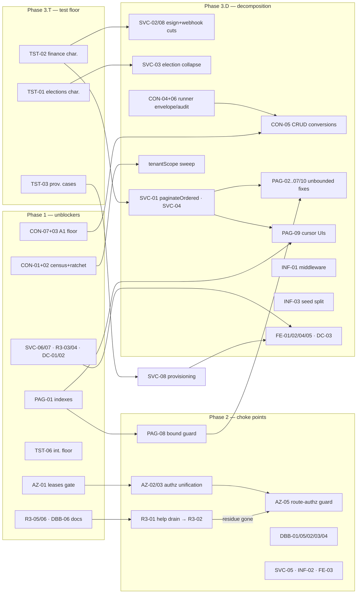

# Refactor Audit & Cleanup Roadmap — Full Monorepo

**Date**: 2026-09-22
**Author**: Claude (multi-agent refactor-audit workflow)
**Status**: Audit only — no code changes in this pass
**Scope**: Full monorepo (~2,800 files / ~390K LOC) at commit `07e56b6e7`. Findings
adversarially verified; counts re-run at HEAD.

> Successor to `docs/audits/2026-07-18-refactor-audit-and-cleanup-roadmap.md`.
> That roadmap's items were re-checked rather than re-assumed: several drained
> (getBaseUrl 11→1, the A1/role-v3 deferred phases, DBB-01/03/04), and this audit
> corrects three of its numbers upward (see §1 and CON-01).

## 1. Headline numbers

| Surface | Measured at HEAD `07e56b6e7` | Source |
|---|---|---|
| Largest services (LOC) | finance 2,554 · site-blocks 2,091 · esign 1,799 · provisioning 1,628 · elections 1,427 — 11 files >1,000; services dir 38,333 LOC across 116 top-level `*.ts` (42,810 / 137 recursive) | SVC verifiedBaseline |
| Routes on contract style | 238 of 283 `route.ts` under `api/v1` (84.1%) call `runRoute`; allowlist 46 entries, ceiling pinned at exactly 46 | `pnpm guard:contracts`; CON-03 |
| tenantScope adoption | 12 `contract.ts` declare it (9 query/body route files); **157** hand-resolving single-tenant routes are the real backlog (prior audit said 121 — undercount) | CON-01/CON-02 |
| Legacy-role residue | 13 dead-legacy literals in 7 allowlisted files, all AT ceiling; guard green (10,507 comments / 2,501 files scanned); the live residue is 46 of 66 help MDX files + seeded FAQs | R3 verifiedBaseline, R3-01 |
| Hard-tier pagination | 7 endpoints migrated to sort-preserving keyset; **3 genuinely unbounded** in the B3 doc set + 5 post-doc unbounded lists; **0 supporting indexes** exist for any migrated sort (76 CREATE INDEX lines in migrations, none touch a keyset table) | PAG verifiedBaseline, PAG-01 |
| Design-token baseline | 70 files / 867 violations (down from ~1,650); web non-mobile in-scope: 40 files / 305, of which **270 bare focus rings in 36 files**; admin 12 files / 69, raw-palette drain complete | FE verifiedBaseline |
| Hooks test ratio | 111 hook sources, 71 have a dedicated test → **40 untested**, largest `use-board.ts` (609 LOC, 31 invalidateQueries, 17 mutations) | TST-04 |
| Service test depth | elections-service: **0 direct tests** (15/17 route tests mock it whole); finance-service: 12 direct cases for 2,554 LOC / 43 exports; 52 integration files with **no collected-count floor** | TST-01/02/06 |
| DB-boundary scans | route layer clean (284 scanned, 0 offenders) but **21 server-component files import tables outside any guard's scan root**; admin runs `guard:db-access` in a mode with the unsafe ledger off (73 files); 271 `createUnscopedClient()` calls ride on 91 import-level AUTHZ comments | DBB-01/02/04 |
| Dead code | 13 unreferenced app files (~1,488 LOC); 119 of 419 `packages/shared` exports have zero external references, ~16 dead repo-wide; 5 service exports unreferenced anywhere | DC-01/03, SVC-07 |
| Guard tooling | 32 `guard:*` tasks (31 bundled in `run-lint-guards.mjs`), 41 verify scripts — **28 have no self-test** | TST-05, PAG-08 |

## 2. Executive summary

- **The architecture is sound; the debt is in file size, migration tails, and un-policed boundaries.** Zero of 65 findings proposed a redesign. The strongest evidence: every B3 hard-tier migration implemented the design doc's contract *verbatim* (cursor shape, tiebreaker, envelope), and all 46 contract allowlist entries carry a named, checkable runner limitation.
- **Three programs to FINISH, not start:** (1) the tenantScope sweep — the prior audit's "121" was an undercount; the real backlog is **157**, and the "opportunistic convergence" bet has measurably failed (adoption flat 12→12 in nine weeks; last deliberate commit 2026-06-05) while no guard detects the floor falling (CON-01/02); (2) the B3 hard tier — the design doc's **two named index DDLs were never applied**, so six migrated keyset sorts currently beat the old path at scale only on paper (PAG-01); (3) A1 contract drain — close it out honestly: velocity has been zero since June while the set grew 37→46, but ~42 of 46 are structurally uncontractable (CON-03).
- **Three new items the prior audit never saw:** the **leases API has no role gate at all** — any community member, including tenants, can read and mutate every lease including rent amounts (AZ-01, high, S to fix); Tier-C didn't disappear, it **moved to page.tsx**, where no DB-boundary guard scans (DBB-01); and **admin's guard:db-access mode switches the unsafe-import ledger off entirely** — it prints PASS over 73 service-role-client files it never inventoried (DBB-02).
- **Decomposition is gated on tests, and the audit says so per-file:** elections-service (the §718.128 state machine) and finance-service execute no real code in any fast test — route tests mock them whole (TST-01/02). SVC-02/SVC-03 carry explicit dependsOn gates. esign and provisioning, by contrast, are decomposition-ready today (SVC-08, TST-03).
- **The ratchet machinery is excellent and under-reused.** `guard:contracts` proves the ceiling pattern works (its floor held); tenantScope, pagination bounds, dead exports, and file-local helpers all lack the same shrink-only ledger. Half of Phase 1–2 is cheap guards, not code moves.
- **Role-v3 is genuinely done** — all four deferred phases shipped and were re-verified (root-exclusive powers 15/15 green, matrix collapsed, bridge drained). The only live residue is the deliberately-exempt help/FAQ content vocabulary (R3-01), which is a content migration, not an architecture item.
- **One runner capability blocks real work:** `runRoute` cannot express an optional top-level envelope sibling, which produced two independent WeakMap side-channel hacks in-repo and is the actual (mis-recorded) blocker on the meetings conversion (CON-04; the prior audit called meetings unblocked — wrong).

## 3. What's healthy

- **Guard suite quality is the repo's standout asset.** `guard:legacy-roles` is in strict BAN mode, self-tests its own parser-failure detector, asserts its roots, and refuses to pass on an empty scan — the canonical shape from `.claude/rules/verification.md`, fully realized. `guard:db-access` is AST-based (catches dynamic `import()` and re-exports). All 31 bundled guards run in CI's required `Lint` job, parallelized, with dead-allowlist-entry sweeps so ledgers self-correct when files die.
- **The audit-to-code loop demonstrably closes.** The July audit's high-impact authz finding (ungated `/invitations`) is fixed with a matrix call and an explanatory comment; its DBB-01/03/04 items are verifiably done; getBaseUrl went 11 copies → 1; the dead exports it named are gone; prior roadmap items surviving here are re-measured survivors, not stale copies.
- **The route→service→scoped-client layering holds where guards look**: 284 route.ts, zero direct table imports, zero query-operator imports; all 143 client components across both apps free of DB access; RLS + the write trigger + the scoped client form three independent enforcement levels.
- **The contract layer is honest.** Every allowlist entry carries a specific, source-checkable rationale; the envelope invariant ("wire shape byte-identical") held across 238 conversions, which is why the drain was safe to automate; the dependency-injection seam in `apps/web/src/lib/api/run-route.ts` is the right package-boundary design and is generalisable (CON-04/06 both close by widening it).
- **Statutory paths have real teeth where it counts:** elections wraps every domain write and its audit insert in ONE transaction, and the §718.128 secret-ballot path is the one service function exercised against a real database (no vi.mock). Compliance deadline math is single-sourced in `posting-deadline.ts` per the date-fns trap.
- **Test-harness hygiene is above average:** all 18 unit-suite skips are env-conditional (audited one by one, zero stale); e2e already has a collected-count floor assertion (the pattern TST-06 ports to integration); vitest node/jsdom split fails loud by design.
- **Dead-code debt is negligible**: 3 TODO markers repo-wide; cross-app copies that exist are deliberate and documented in-file (cron-auth, search-shortcut); admin's orphan scan returned zero.
- **Deploy/migration policy is coherent** (code-only deploy gated on CI, manual prod migration applies, expand/contract discipline) — recorded deliberate, not re-litigated here.

## 4. Findings by theme

65 findings survived adversarial verification across 10 dimensions; **0 were rejected** — every surviving finding had its counts re-run at HEAD, and 16 had evidence errors corrected in place (marked ✎).

### 4.1 Services (SVC) — 8 surviving, 0 rejected

Six oversized services carry the bulk of the LOC debt; the recurring shapes are hand-rolled cursor plumbing, audited-mutation boilerplate, and state machines copied four times. This was the prior audit's un-drained tail, and it has grown (+144 LOC on finance alone).

| ID | Finding | Files | Impact | Effort | Risk |
|---|---|---|---|---|---|
| SVC-01 ✎ | Ordered-keyset cursor trio re-implemented in 6 services (19 functions) → generic `paginateOrdered` | finance/faq/polls/package-visitor/work-orders/operations services | high | M | low |
| SVC-02 | finance-service 2,554 LOC / 29 exports; cut the import-isolated 584-line Stripe-webhook section first | `apps/web/src/lib/services/finance-service.ts` | high | L | med |
| SVC-03 | Elections open/close/certify/cancel = 4 copies of one transactional state machine; guard branches have zero direct tests | `apps/web/src/lib/services/elections-service.ts` | med | M | high |
| SVC-04 ✎ | 103 `logAuditEvent` call sites in 25 service files; 64-fold-repeated metadata envelope → `mutateWithAudit` | 7 top services | med | M | low |
| SVC-05 | Unsubscribe HMAC codec + write are line-for-line clones (207 lines, 4 files); the security-critical `timingSafeEqual` verify exists twice | snowbird/insurance token+service files | med | S | low |
| SVC-06 | `isUniqueConstraintError` ×5, `hasPostgresErrorCode` ×3 local copies | 6 service files | low | S | low |
| SVC-07 | 5 exported service functions have zero references anywhere; no dead-export guard | faq/work-orders/help/resource services | low | S | low |
| SVC-08 ✎ | esign (1,799) and provisioning (1,628) carry declared subsystem banners never turned into module boundaries; site-blocks (2,091) is bigger than both | 3 service files | med | M | low |

Evidence notes (high-impact rows):
- **SVC-01**: `grep -rn "function [a-z]*[eE]ncode[a-zA-Z]*Cursor\|…" apps/web/src/lib/services/*.ts` → 19 functions / 6 files (faq 3, finance 3, operations 4, package-visitor 3, polls 3, work-orders 6). `clampPageSize` already single-sourced at `packages/db/src/pagination.ts:169` — the codec/plumbing is the copy. Cross-ref PAG: this is the write-side twin of PAG-01's index gap.
- **SVC-02**: `processFinanceStripeEvent` has exactly one non-self importer (`api/v1/webhooks/stripe/route.ts`) — the 584-line cut is import-isolated by construction. The assessment CRUD in the same file has ZERO direct tests (all three referencing test files `vi.mock` the service), hence the dependsOn gate on TST-02.
- **SVC-04**: `grep -rc "logAuditEvent(" apps/web/src/lib/services/*.ts` → 103 / 25 files; `grep -rc "requestId: requestId ?? null"` → 64 across 9 files.
- **SVC-05**: normalized `diff` of the two token files shows every difference is docblock wording, env-var name, or identifier spelling. The insurance header self-reports the clone — but documents only *secret* isolation, which the parameterized codec preserves.

### 4.2 Role-v3 (R3) — 6 surviving, 0 rejected

Phase 4 / 4.4 / uniform checkPermissionV2 / root-exclusive powers all verified shipped — the prior survey's "73 dead literals / 20 files / ADMIN_ROLES 72/13" is superseded by 13/7 with every file exactly at ceiling. What remains is one content migration, two guard blind spots, and two stale documents.

| ID | Finding | Files | Impact | Effort | Risk |
|---|---|---|---|---|---|
| R3-01 ✎ | Drain the last live legacy-vocabulary surface: 46/66 help MDX + seeded-FAQ `roleVisibility` still ride the resolve→legacy→expand bridge | `apps/web/src/content/help`, `lib/help/viewer-role.ts`, `packages/shared/src/default-faqs.ts` | med | M | low |
| R3-02 ✎ | `guard:legacy-roles` has two counting holes: unquoted object keys, and quoted `'pm_admin'` (pass-1 LITERAL omits it entirely) | `scripts/verify-legacy-roles.ts` + 5 live sites | low | S | low |
| R3-03 | `useCommunityRoster` fetches the entire roster unfiltered; its own docblock says the server filter works today | `apps/web/src/hooks/use-role-management.ts`, `api/v1/residents/route.ts` | med | S | low |
| R3-04 | Dead legacy branch in snowbird-digest owner resolution: `role === 'owner'` can never match the v3 enum | `apps/web/src/lib/services/snowbird-digest-processor.ts:102` | low | S | low |
| R3-05 | designation-as-gate grown past ADR-006's statutory-only list (export eligibility, insurance recipients) without an ADR amendment | `export/export-route-auth.ts`, `insurance-alert-processor.ts`, `docs/adr/ADR-006…md` | med | S | med |
| R3-06 | ADR-006 transition-status still describes shipped work as open (Phase 4 columns, checkPermissionV2 JSONB, R3-03b ack gate) | `docs/adr/ADR-006-root-manager-role-model.md` | low | S | low |

Evidence notes: R3-01's consumer fan-out is 26 lines / 11 files (corrected from 29/12). R3-02: 5 live unquoted `pm_admin:` keys, and `apps/admin/src/app/dev/agent-login/route.ts:69` demonstrates a quoted `'pm_admin'` passing clean only because the token is absent from pass 1. R3-04: migration `0020` rebuilt the enum to exactly {resident, property_manager, root_manager} — the DB physically cannot yield `'owner'`.

### 4.3 Authorization (AZ) — 5 surviving, 0 rejected

One live gap, a vocabulary problem, and a metadata problem. 63 of 63 role-gate-less routes were read and dispositioned; leases is the only confirmed missing-authz surface, and the route-docblock culture ("auth chain preserved verbatim") is genuinely exceptional.

| ID | Finding | Files | Impact | Effort | Risk |
|---|---|---|---|---|---|
| AZ-01 | **Leases API has zero role gate** — any member incl. tenants reads/mutates every lease and rent amount; GET returns the unfiltered list | `apps/web/src/app/api/v1/leases/route.ts`, `leases/contract.ts` | **high** | S | low |
| AZ-02 ✎ | Route authz runs on 6 coexisting idioms across 4 management-tier vocabularies; the stated role-v3 Phase 4 dependency is stale — unification is unblocked | `lib/db/access-control.ts`, `packages/shared/src/rbac-matrix.ts`, `lib/api/role-guard.ts` | high | L | med |
| AZ-03 | Half the bespoke domain guards are thin `requirePermission` aliases; half silently fork policy on `membership.isAdmin` outside the matrix (17 inline forks) | `lib/work-orders/common.ts`, `lib/polls/common.ts`, `lib/logistics/common.ts`, `lib/finance/common.ts` | med | M | low |
| AZ-04 ✎ | `POST /api/v1/upload` mints a presigned PUT into the private documents bucket for ANY member while the record write is manager-gated | `api/v1/upload/route.ts`, `upload/contract.ts`, `documents/route.ts` | med | S | low |
| AZ-05 | `runRoute` `permission` metadata is unenforced and demonstrably drifts — the leases placeholder advertised a policy source that doesn't exist | `packages/api-contract`, `scripts/verify-contracts.ts` | low | M | low |

Evidence notes (AZ-01): `grep -rn 'requirePermission(\|requireRole(\|isAdminRole\|membership.isAdmin' apps/web/src/app/api/v1/leases/` → **zero hits**; the route's own docblock enumerates the chain as membership-only; `requireEntitledForAdminRead` short-circuits for non-admins so it is not a role gate; the contract calls its own permission entries "DOCUMENTED PLACEHOLDERS". The July audit's `/invitations` fix (matrix call + `// AZ-01` comment at `invitations/route.ts:55`) is the exact precedent. AZ-02 counts: 76 files / 159 sites `requirePermission`, 79 files bespoke domain guards, 17 `requireRole`, 5 `isAdminRole`, 17 inline `membership.isAdmin` forks. AZ-01 vs PAG-04: leases appears in both — the gate fix is independent of and precedes the pagination split.

### 4.4 Contracts & tenant scope (CON) — 10 surviving, 0 rejected

The A1 lane is at its floor (238/283 contracted; ~42 of 46 allowlist entries structurally uncontractable); the successor lane is tenantScope, and this audit found both a measurement error (121→157) and the reason nobody noticed (the adoption guard explicitly disclaims adoption).

| ID | Finding | Files | Impact | Effort | Risk |
|---|---|---|---|---|---|
| CON-01 ✎ | tenantScope backlog is **157**, not 121 — 36 routes resolve via `@/lib/finance/request`, invisible to the resolver-only grep | `amenities/assessments/elections/delinquency` routes, `lib/finance/request.ts` | high | L | low |
| CON-02 | `guard:tenant-scope` validates well-formedness only; 157 routes can hand-call the resolver forever while it prints ✅; adoption flat 12→12 since the last pilot (2026-06-05) | `scripts/verify-tenant-scope.ts` | high | S | low |
| CON-03 ✎ | A1 velocity is **negative**: zero drains since 2026-06-05, allowlist 37→46, ceiling now pinned at 46 with zero headroom → close the lane with an explicit floor | `scripts/verify-contracts.ts`, `.claude/skills/drain-loop.md` | med | S | low |
| CON-04 | Runner cannot express an optional envelope sibling → two independent WeakMap smuggling hacks; the real (mis-recorded) blocker on meetings | `packages/api-contract/src/run-route.ts`, `documents/route.ts`, `announcements/route.ts` | med | M | low |
| CON-05 ✎ | The three legacy action-dispatch CRUD routes (announcements/meetings/maintenance-requests) are the last drainable allowlist content; no status-code blocker anywhere | 3 route files | med | M | med |
| CON-06 ✎ | `withAuditLog` is used by exactly 1 of 284 routes and is structurally un-nestable with `runRoute` (input-shaped vs `(req, ctx, audit)`) | `lib/middleware/audit-middleware.ts`, `announcements/route.ts` | med | M | low |
| CON-07 ✎ | Three out-of-sync registries claim to know what can never be contracted; the machine-readable one lists zero classifications; drain-loop PERMANENT_SKIPS stale by 3 | `.claude/rules/api-patterns.md`, `verify-contracts.ts`, `drain-loop.md` | med | S | low |
| CON-08 ✎ | `tenantScope: { in: 'path' }` cannot carry the sweep — only 2 contracted routes under `/communities/[id]`, 1 path declaration repo-wide; scope to query/body | `.claude/rules/api-patterns.md`, `communities/[id]/cancel/contract.ts` | low | S | low |
| CON-09 | Three coexisting client-tenant-trust idioms (resolver 157 / finance-parser 55 / raw header 15) defeat any single-grep velocity metric; the 15 header-only files' cross-check discipline is unmeasured | `lib/finance/request.ts`, `lib/api/tenant-context.ts` | med | S | low |
| CON-10 | Adoption held wire shape byte-identical on all 238 drains — carry that as an explicit acceptance gate (and the 400→404 header-mismatch check) on the tenantScope sweep | `walk-paginated` consumers, `api-patterns.md` conventions | med | S | low |

Evidence notes: CON-01 chain — 176 (contracted ∧ hand-resolved by either idiom ∧ no `tenantScope`) − 19 legitimately non-declaring (`/pm/`, `/admin/`, `/internal/`, `/webhooks/`) = **157**, all exact. `lib/finance/request.ts:17` is literally `return resolveEffectiveCommunityId(req, parsedCommunityId)`. CON-02: `verify-tenant-scope.ts:7` verbatim — "it does NOT require routes to adopt tenantScope (that converges opportunistically)"; the bet's measured result is 12→12. CON-05/06 cross-ref PAG-09 (announcements appears in both — one owner per item, evidence shared). CON-09's suggestedApproach routes the 15-C-file / 94-neither reconciliation to the authz lane — that is the one place a genuine tenant-trust defect could hide and neither audit measured it.

### 4.5 DB boundary (DBB) — 6 surviving, 0 rejected

The route layer is a hard zero; the boundary problem moved to where the guards don't look — server components — and the admin app runs its DB guard in a mode that switches the ledger off.

| ID | Finding | Files | Impact | Effort | Risk |
|---|---|---|---|---|---|
| DBB-01 | Tier C didn't disappear — it moved to page.tsx: **21 offender files outside any guard's scan root** (`SCAN_ROOT = 'apps/web/src/app/api'`, filename `route.ts` only) | `scripts/verify-route-table-imports.ts` + 21 app files | high | M | low |
| DBB-02 | `guard:db-access` runs admin in a mode where the unsafe-import ledger is empty by construction: 73 service-role-client files, 0 scoped clients, still prints PASS | `scripts/verify-scoped-db-access.ts:381-391,514` | high | M | med |
| DBB-03 | AUTHZ rationale demanded for `/unsafe` (114 files ✓) but not for `/supabase/admin` — the strictly more powerful client (96 files; 12 web-package files carry none; all 71 admin files unrationaled via DBB-02) | `scripts/verify-authz-comments.ts:42` | high | M | low |
| DBB-04 | One AUTHZ comment per file gates 271 `createUnscopedClient()` call sites across 91 files (28 in account-lifecycle alone) — a file can add a 29th unrelated call with every guard green | `scripts/verify-authz-comments.ts`, 4 named services | med | M | low |
| DBB-05 | The route-table guard hand-rolls a regex import scanner while the sibling parses TS — three silent bypass shapes (namespace import, re-export, dynamic import); today a hole, not a violation | `scripts/verify-route-table-imports.ts:140-213` | med | S | low |
| DBB-06 | The guard's own docblock asserts "89 files grandfathered" while its allowlist is an empty set and its success line instructs a drain of nothing — stale text that generated this audit's own stale premise | `scripts/verify-route-table-imports.ts:15-16` | low | S | low |

Evidence notes: DBB-01 — re-running the guard's own ALLOWED_SYMBOLS logic over `apps/(authenticated)` + mobile + demo + api → `files: 654, offenders: 21` (20 page.tsx + 1 non-api route.ts); 6 page.tsx are *permanent* DB004 allowlist entries. DBB-02 — line 514 is the ONLY mode-dependent branch; admin keeps DB001–003 but never DB004 or the dead-entry sweep; no docblock declares this intentional.

### 4.6 Pagination (PAG) — 10 surviving, 0 rejected

The B3 program executed its design verbatim (the healthiest finding of the audit) — but shipped without the indexes the same doc prescribed, left 3 unbounded + 5 post-doc unbounded lists, and the client layer walks every new page back into one array.

| ID | Finding | Files | Impact | Effort | Risk |
|---|---|---|---|---|---|
| PAG-01 ✎ | Six migrated hard-tier endpoints have **zero supporting indexes**; the design doc's two named DDLs (`faqs_active_order_idx`, `announcements_active_feed_idx`) were written and never applied | `packages/db/src/schema/{announcements,faqs,forum-threads,vendors,assessments,visitor-log}.ts` | **high** | S | low |
| PAG-02 | Forum replies unbounded (`selectFrom(forumReplies, …)` no limit + a second unbounded deleted-replies read merged in JS) — highest per-day growth surface | `polls-service.ts:568-573`, `forum/threads/[id]/route.ts` | high | M | med |
| PAG-03 | Reservations resident path = full fetch + client-side `.slice()` — an explicit B3 Non-Goal | `api/v1/reservations/route.ts:39-45`, `work-orders-service.ts:1031-1041` | med | M | low |
| PAG-04 | Leases: two full-table reads on one request (`renewal_chain_for` branch), JS post-filters, zero pagination markers | `api/v1/leases/route.ts:204/:240`, `lease-service.ts:43-46` | med | M | med |
| PAG-05 ✎ | Meetings GET unbounded when the optional date range is omitted (every meeting since inception); same range-less call on the Google-sync path | `meeting-service.ts:52-62`, `calendar-sync-service.ts:220` | med | M | low |
| PAG-06 | Two post-doc insurance endpoints read the whole table and sort in JS; a docblock *asserts* "bounded per community" | `insurance-service.ts:18-21,63-69` | med | S | low |
| PAG-07 | Elections silently truncates at 25 (default 10) with no cursor or `hasMore` — on the §718 record-retention surface | `elections-service.ts:680,205-206`, `api/v1/elections/route.ts:44` | med | S | med |
| PAG-08 | **No guard polices unbounded list endpoints** — 0 of 32 guards; 5 post-doc offenders; 133 routes need triage | `scripts/run-lint-guards.mjs`, `package.json` | high | M | low |
| PAG-09 | Every migrated endpoint's client still `walkPaginated`s all pages (18 consumers) — N sorted round-trips, same bytes, new silent 2,000-row truncation | `walk-paginated.ts`, 4 named hooks | med | M | med |
| PAG-10 | `access-request-service` reads the entire `access_requests` table **five times** to find one row by PK — on an OTP-verification path | `access-request-service.ts:82,208,322,472,533` | low | S | low |

Evidence notes: PAG-01 — `grep -rh "CREATE INDEX" packages/db/migrations/*.sql | wc -l` → 76; filtered to keyset tables → **0**. The fix is one expand migration using the doc's own DDL. PAG-09 cross-refs CON-05 on announcements and SVC-01 on the codecs. PAG-07's order `(opensAt desc, id desc)` is already cursor-ready and `idx_elections_community_dates` already exists.

### 4.7 Frontend & design system (FE) — 5 surviving, 0 rejected

The token program is measurably halving (1,650→867); what's left in web is one homogeneous, mechanically drainable class plus three giant components.

| ID | Finding | Files | Impact | Effort | Risk |
|---|---|---|---|---|---|
| FE-01 | Web non-mobile design-token debt = **270 bare focus rings in 36 files**, one class, codemod-able; the correct target form is self-documented in the guard's own test table | `scripts/design-token-baseline.json` + 36 files (worst: assessment-manager 43) | med | M | low |
| FE-02 | site-editor-v3 holds the three largest components (1,565 / 1,288 / 1,054 lines); 14 web components >500 | `PagesPanel.tsx`, `PublishSheet.tsx`, `EditorRoot.tsx` | med | L | med |
| FE-03 | Byte-identical `cn()` in three places; both app copies are one-line re-export candidates (102 import sites keep working) | `apps/web/src/lib/utils.ts`, `apps/admin/src/lib/utils/index.ts`, `packages/ui/src/utils/cn.ts` | low | S | low |
| FE-04 ✎ | Parallel hook families: condo/apartment onboarding are slug-only twins (only 2 type-name line-pairs differ); unit/resident/user search share a skeleton; `ProfileStepData` triplicated byte-identically | 8 hook/type files | low | M | low |
| FE-05 | NavRail's three `@deprecated` props have zero app consumers — code path + its 24-fixture test weight deletable | `packages/ui/src/components/NavRail.tsx` (643 LOC) | low | S | low |

Evidence notes: FE-01 — baseline scan → 36 files / 270 occurrences (full-scan cross-check: 272); remaining non-focus web debt is exactly render-authored-html.ts raw-hex ×23 + three dark-mode raw-palette files ×12, both CLAUDE.md-frozen. FE-04 correction: the user-search min-length gate is conditional (numeric ≥1, else ≥2), so the factory needs a predicate, not a `minLength` number.

### 4.8 Testing (TST) — 6 surviving, 0 rejected

Coverage is broad at the route level and nearly absent at the service level — exactly the inverse of what Phase-3 decomposition needs.

| ID | Finding | Files | Impact | Effort | Risk |
|---|---|---|---|---|---|
| TST-01 | elections-service (1,427 LOC, 16 exported functions, §718.128) has **zero direct tests**; 15/17 route tests mock it whole; the one real-DB test covers 1 function and is excluded from the unit lane | `elections-service.ts`, `vitest.shared.ts:92` | high | M | high |
| TST-02 | finance-service (2,554 LOC, 43 exports) has 12 direct cases; money math (statements, late fees, delinquency) executes nowhere in unit or integration lanes | `finance-service.ts`, 2 test files | high | L | high |
| TST-03 | esign is decomposition-ready (60 direct cases); provisioning needs ~10 retry/idempotency cases first (33 cases, zero integration depth, 5 wholesale mocks) | esign/provisioning services + tests | med | M | med |
| TST-04 | 40 of 111 hooks have no dedicated test; top gap use-board (609 LOC, 31 invalidations, 17 mutations) — the cache-coherence contracts a frontend refactor breaks first | `use-board.ts` + 4 named hooks | med | M | low |
| TST-05 | 28 of 41 guard scripts have no self-test — including verify-scoped-db-access and verify-contracts; a silently-unmatching guard reports ✅ over its own defect | `scripts/__tests__/` (13 have fixtures — the pattern exists) | med | M | low |
| TST-06 | Integration suite has no collected-count floor: a missing DATABASE_URL runs 0 of 52 files and exits 0; e2e already solved this (`expectedTestCount` at `e2e.yml:378`) — port it | `apps/web/vitest.integration.config.ts` | med | S | low |

### 4.9 Infra (INF) — 4 surviving, 0 rejected

| ID | Finding | Files | Impact | Effort | Risk |
|---|---|---|---|---|---|
| INF-01 | `middleware.ts`: 1,345 lines, ~800-line exported handler interleaving 9 ordering-constrained concerns (67 commits since March); 12 pure modules + 11 middleware()-level tests already exist as the seam | `apps/web/src/middleware.ts` | high | M | med |
| INF-02 | The role-visibility gate is defined twice (`roleMatchesRegistryItem` vs `itemVisibleForRole`) over duplicate unions — sidebar and palette can silently disagree | `feature-registry.ts:764`, `nav-config.ts:477` | med | S | low |
| INF-03 ✎ | seed-community (2,147, 39 named functions) + seed-demo (2,146) splittable at existing seams — but `seed:verify` checks ~half of what they write (0 assertions on units/leases/maintenance/wizard/announcements) and CI never executes a real seed | `packages/db/src/seed/seed-community.ts`, `scripts/verify-seed-evidence.ts` | med | M | med |
| INF-04 | scoped-db-access-guard.yml runs the identical check the required Lint context already ran, and — unlike its migration-chain sibling — documents nothing about why | `.github/workflows/scoped-db-access-guard.yml:66` | low | S | low |

Evidence notes: INF-01 block sizes measured by awk: 203 (public-host fork), 130 (auth gates), 111 (support gate); two CI guards parse literals out of the file and must move with any extraction. INF-03 order matters: extend the verifier FIRST so the split can go red on `pnpm seed:verify`.

### 4.10 Dead code (DC) — 5 surviving, 0 rejected

| ID | Finding | Files | Impact | Effort | Risk |
|---|---|---|---|---|---|
| DC-01 | 12 unreferenced web files + 1 admin orphan (~1,479 LOC), last touched Mar–Jul 2026 — deletion passes are self-proving | `help-link.tsx` … `SectionInserter.tsx`, `hex-color.ts` | med | S | low |
| DC-02 | Retired flat `site-blocks.ts` (231 LOC) still ships behind a barrel re-export with zero consumers; its own docblock says "retired in PR #9" | `packages/shared/src/site-blocks.ts` | low | S | low |
| DC-03 | 119 of 419 `packages/shared` public exports have zero external references; 16 dead repo-wide; packages/ui tokens add 4 | `branding.ts`, `esign-constants.ts`, `ui/tokens/*` etc. | med | M | med |
| DC-04 | 44 file-local date helpers despite canonical `lib/utils/format-date.ts` (6 consumers); `cn()` ×3 | `visitor-columns.tsx` ≡ `package-columns.tsx` pair byte-identical | med | M | low |
| DC-05 | Two statutory violation-notice PDF routes have zero client call sites — likely gated-and-unwired (feature flag OFF per legal-risk audit), needs product intent before deletion | `violations/[id]/notice`, `violations/[id]/hearing-notice` | low | S | med |

Cross-dimension dedupe: SVC-07 (5 dead service exports) and DC-01/03 are the same sweep — one `guard:service-dead-exports` / export-usage ratchet covers all three. DC-05's routes are also 2 of CON-03's 46 allowlist entries (deletion shrinks the floor).

## 5. Phased cleanup roadmap

Sequenced by **dependency**, not impact. The two load-bearing gates: (a) TST-01/TST-02 characterization tests precede any decomposition of the services they cover (the guard branches are the behavior, and route-mock green pins nothing); (b) measurement/ratchet items (CON-01/02, CON-07, PAG-08) precede their sweeps, because an un-instrumented drain is how the prior audit's numbers silently rotted. AZ-01 and PAG-01 have no predecessors and are the only two *high-impact small* fixes in the audit — they lead.

### Phase 1 — Unblockers and unguarded gaps (weeks 1–2)

| # | Item | Effort | Risk | Depends on | Existing tooling |
|---|---|---|---|---|---|
| 1.1 | **AZ-01** — gate `POST/PATCH/DELETE /leases` with `requirePermission(membership,'units','write')`; declare GET intent (self-scoped rows for non-managers); 403-for-tenant test | S | low | — | `root-exclusive-routes.test.ts` pattern; invitations AZ-01 fix as precedent |
| 1.2 | **PAG-01** — one expand migration adding the B3 doc's two named partial indexes + 4 analogous (vendors/assessments/visitors/forum_threads); apply before traffic per expand/contract discipline | S | low | — | doc DDLs verbatim at `b3-…-design.md:193,213` |
| 1.3 | **CON-01 + CON-02** (one PR) — idiom-agnostic 157-route census (union of resolver + finance-parser); port `checkCeiling` into `verify-tenant-scope.ts`, freeze at 157, print the denominator | S | low | — | `scripts/lib/ceiling.ts`, `verify-contracts.ts` shape |
| 1.4 | **CON-07 + CON-03** — allowlist entries carry classification as data (`Map<path, reason>`); state the A1 floor (~42 permanent) explicitly and close the lane; regenerate drain-loop PERMANENT_SKIPS from the map, drop 3 stale entries | S | low | — | workflow's existing RUNNER_BLOCKED taxonomy; `drain-one-batch.workflow.js:222` one-line change |
| 1.5 | **TST-06** — integration collected-count floor (port `expectedTestCount` shape) | S | low | — | `e2e.yml:378` |
| 1.6 | **R3-05 + R3-06 + DBB-06** — doc corrections in one PR: ADR-006 addendum (designation grants read/egress breadth, never write; strike shipped-deferred bullets), guard-header truth | S | low | — | ADR addendum convention |
| 1.7 | **SVC-06 + SVC-07 + R3-04 + R3-03 + DC-01 + DC-02** — the mechanical trash take: shared `isUniqueConstraintError`, delete 5 dead exports + 13 orphan files, delete the dead `'owner'` arm, pass the roles filter in useCommunityRoster | S | low | — | shrink-only baseline pattern for the dead-export guard |

### Phase 2 — Choke-point consolidation (weeks 2–6)

| # | Item | Effort | Risk | Depends on |
|---|---|---|---|---|
| 2.1 | **AZ-02/03 authz unification** — extend RBAC_RESOURCES (leases, faqs, site-editor, forum moderation), drain `requireRole`/`isAdminRole`/inline forks onto the matrix; keep `requireRootManager`/`requirePlatformAdmin`/`requireCronSecret` as declared exceptions; add the five-vocabulary pin test | L | med | role-v3 shipped (verified); 1.1 lands leases' resource first |
| 2.2 | **AZ-05** — `guard:route-authz`: contract.permission ↔ call-site cross-check + mandatory `// AUTHZ:` declaration for zero-idiom routes; converts AZ-01-class gaps into build failures | M | low | 2.1's resource set; reuse verify-authz-comments grammar |
| 2.3 | **DBB-01** — widen route-table guard to all of `apps/web/src/app`, seed 21 as shrink-only grandfather, drain to services (most targets already exist); forbid new `page.tsx` DB004 entries | M | low | — |
| 2.4 | **DBB-05** — port the AST visitor into the route-table guard + self-test both directions | S | low | lands best inside 2.3's PR |
| 2.5 | **DBB-02 + DBB-03** — admin gets a real unsafe-import ledger (73 named entries, `--warn` first); widen AUTHZ-comment requirement to `/supabase/admin` (210 checked imports) behind a shrink-only baseline | M | med | — |
| 2.6 | **DBB-04** — per-file call-site ceilings on `createUnscopedClient()`; table-naming rationale made grep-checkable | M | low | 2.5 |
| 2.7 | **PAG-08** — unbounded-list ratchet guard, baseline from the 133-route triage, named non-candidates with rationale strings | M | low | 1.2 (indexes before pressure); triage feeds PAG items in 3.x |
| 2.8 | **R3-01** — the help/FAQ vocabulary drain: content rewrite first (46 MDX + prod FAQ rows via the repair convention), then delete the alias fan-out, tighten frontmatter schema to v3 enum, zero the guard HELP bucket; **then R3-02** guard holes close with no residue left to hide in | M | low | 1.6 (ADR wording settled first) |
| 2.9 | **SVC-05 + INF-02 + FE-03 + DC-04(step 1)** — small single-source wins: `createUnsubscribeTokenCodec(envVar)`, one shared visibility predicate, `cn()` re-export shims, format-date step 1 | S–M | low | — |
| 2.10 | **TST-05 (first tranche)** — guard self-tests for the five highest-stakes untested guards | M | low | — |
| 2.11 | **INF-04** — retire or annotate the duplicate scoped-db-access workflow | S | low | branch-protection list check |
| 2.12 | **DC-05** — product decision on violation-notice PDF routes (wire the button or delete + shrink allowlist by 2) | S | med | product input |

### Phase 3 — Structural decomposition, tests first (weeks 4–12, overlapping)

**3.T — Test floor (gates everything below):**

| # | Item | Effort | Risk |
|---|---|---|---|
| 3.T1 | **TST-01** — elections-service characterization suite: all 16 exported functions vs mocked scoped client, locking every state-machine transition, proxy trio, eligibility snapshot | M | — |
| 3.T2 | **TST-02 (seam 1)** — finance statements + delinquency/late-fee math characterization, reusing the webhook-file mock scaffold | L | — |
| 3.T3 | **TST-03 (provisioning half)** — ~10 retry/idempotency cases on webhook re-delivery + watchdog re-entry | M | — |
| 3.T4 | **TST-04** — renderHook backfill for the top-5 untested hooks (use-board first) | M | — |

**3.D — Decomposition (each lands behind re-export shims; CON-10's acceptance gate applies: unit tests pass WITHOUT edited response assertions):**

| # | Item | Effort | Risk | Depends on | Existing tooling |
|---|---|---|---|---|---|
| 3.1 | **SVC-02 step 1 + SVC-08 (esign)** — the two import-isolated, best-tested cuts: finance Stripe-webhook module (584 LOC, single importer); esign module-per-banner behind its barrel (60-test net) | M | low | 3.T2 for finance's later cuts only; esign unblocked today | re-export-shim convention (`components/ui/*`) |
| 3.2 | **SVC-03** — collapse 4 election transitions onto one `transitionElectionStatus` + declarative status table; §718.128 argues for one home for the legal ordering | M | med | **hard gate 3.T1** | `updateProxyStatusForCommunity` is the in-file shape to copy |
| 3.3 | **SVC-01 → SVC-02(cuts 2–4) → SVC-04** — generic `paginateOrdered` in packages/db (one tiebreaker/hasMore implementation); finance ledger/connect/assessment split; `mutateWithAudit` applied per finance sub-module | M–L | low–med | 3.T2; SVC-04 follows SVC-02's split | `b3-hard-tier-pagination-design.md` canonical shape |
| 3.4 | **CON-04 + CON-06 (design together)** — envelope-sibling channel + injected `auditContext` on `RunRouteOptions`; retire both WeakMaps and the quadruple re-parse; blast radius: 40 logAuditEvent route files untouched | M | low | — | `run-route.ts` DI seam precedent |
| 3.5 | **CON-05** — CRUD route conversions in order: maintenance-requests (no blocker) → meetings (after 3.4) → announcements (after 3.4 + hard-tier pagination cross-ref) | M each | med | 3.4 | `/drain-loop` (retargeted per 1.4) |
| 3.6 | **tenantScope sweep batches** — 157 routes, sequenced by blast radius (elections/assessments/delinquency first — statutory wrong-tenant reads), query/body only (CON-08: no path lane) | L | low | 1.3 ratchet | `/drain-loop` machinery + CON-10 acceptance gate |
| 3.7 | **PAG-02/03/04/05/06/07/10** — the unbounded-list fixes; PAG-04 step-1 (filter pushdown, split `renewal_chain_for`) precedes its pagination; PAG-05: make the route range REQUIRED (reuse the 366-day clamp) + bound the sync caller; PAG-07: emit `hasMore` minimum | S–M | low–med | 1.2 indexes; PAG-04 gate fix from 1.1 | `paginateOrdered` from 3.3; existing codecs |
| 3.8 | **PAG-09** — per-endpoint decision: "Load more" cursor UI for forum/visitors/assessments; keep walking only short lists; integration assertion that a capped response shows a truncation notice | M | med | 3.3/3.7 | doc §Consumer Guidance lines 237–243 |
| 3.9 | **INF-01** — middleware composer: 8 blocks into `lib/middleware/`, ordering invariants as tests, the two CI guards' scan paths moved in the same PR; the 11 middleware()-level specs stay as the order-regression suite | M | med | — | existing 12-module seam |
| 3.10 | **INF-03** — extend `verify-seed-evidence.ts` with per-domain row counts FIRST, then split seed-community at its 39 function seams | M | med | verifier extension | existing retry/summarise scaffolding |
| 3.11 | **SVC-08 (provisioning, site-blocks)** + **FE-01** (focus-ring codemod pass over 36 files + baseline ratchet) + **FE-02** (site-editor panel-by-panel, behavior-preserving, gated on its test suite + revert-checks) + **FE-04/FE-05** + **DC-03** (export demotion + usage ratchet) | M–L | low–med | 3.T3 for provisioning | admin-token-codemod (extend); NavRail.test sections API |

### Phase 4 — Deferred programs, pointers only (not budgeted here)

- **Admin/mobile token migration tails**: admin is done (1,088→0 raw palette); mobile stays scheduled behind its own program (CLAUDE.md); `dark:` variants frozen by decision — no action until the token layer gains a theming story. → `docs/superpowers/specs/2026-07-13-design-system-standardization-design.md`.
- **Nested-path tenancy** (`tenantScope in:'path'` at scale): a route-tree project, recorded as a deliberate non-goal per CON-08, not deferred work.
- **Categorical/dark token scale** (community-type chips, staleness escalation on raw ramps): closed only by a `packages/tokens` addition; tracked in memory `token_layer_has_no_categorical_or_dark_scale.md`.
- **E-voting attorney gate (wave 6 / 0062)** and the launch-blocker stack: gating is legal, not refactor — see `docs/LAUNCH-BLOCKERS.md` (canonical; grep citers on status change).
- **`/upload` product decision** (AZ-04): if tenant evidence uploads depend on member-open presign, ship the `// AUTHZ:` declaration and let 2.2's guard own it.

### Dependency diagram

**First 3 PRs:** ① AZ-01 leases role gate + tenant test (the only open missing-authz surface, S to fix, precedent already in the repo). ② PAG-01 keyset-index expand migration — the doc's DDLs verbatim, one file, removes a latent pre-launch perf cliff. ③ CON-01 + CON-02 in one PR — the corrected 157 census plus the ceiling ratchet seeded at it, because every drain after this point is measured against a number that currently doesn't exist in any machine-readable form.

## 6. Method appendix

- **Workflow**: `refactor-audit` — 10 parallel dimension auditors, each adversarially verified against HEAD `07e56b6e7`, then synthesized here. Docs-only pass: no code changed.
- **Verification policy**: every count re-run at HEAD by an independent verifier; high-impact findings always fully verified, otherwise 2 spot-checks per dimension; verdicts CONFIRMED / CORRECTED-in-place / REJECTED; a finding citing documented-intent was tested against that intent (AZ-01's "preserved verbatim" note was ruled a drain artifact, not a policy ruling).
- **Tallies** (surviving / confirmed / corrected / rejected / unchecked):

| Dimension | Surviving | Confirmed | Corrected | Rejected | Unchecked |
|---|---|---|---|---|---|
| SVC Services | 8 | 6 | 2 | 0 | 0 |
| R3 Role-v3 | 6 | 4 | 2 | 0 | 0 |
| AZ Authorization | 5 | 3 | 2 | 0 | 0 |
| CON Contracts & tenant scope | 10 | 4 | 6 | 0 | 0 |
| DBB DB boundary | 6 | 6 | 0 | 0 | 0 |
| PAG Pagination | 10 | 8 | 2 | 0 | 0 |
| FE Frontend & design system | 5 | 4 | 1 | 0 | 0 |
| TST Testing | 6 | 6 | 0 | 0 | 0 |
| INF Infra | 4 | 3 | 1 | 0 | 0 |
| DC Dead code | 5 | 5 | 0 | 0 | 0 |
| **Total** | **65** | **49** | **16** | **0** | **0** |

- **Coverage gaps**: no dimension failed. Three items deliberately left unmeasured and flagged as such rather than asserted: the composition of the 94 route files that use neither tenancy idiom and whether the 15 header-only files cross-check (CON-09 — routed to the authz lane), the e2e "~72 test blocks" figure (not reproducible without `playwright test --list`; treat as unverified), and the honesty of the 13 breadcrumbs:exempt entries beyond the 3 spot-checked (count itself corrected to 20 files: 12 redirect-only + 8 delegated).
- **Known environment note**: the audit brief's repo root (`/home/user/PropertyPro`) does not exist in the verification environment; all measurements ran at `/Users/jphilistin/Documents/Coding/PropertyPro` @ `07e56b6e7`.
