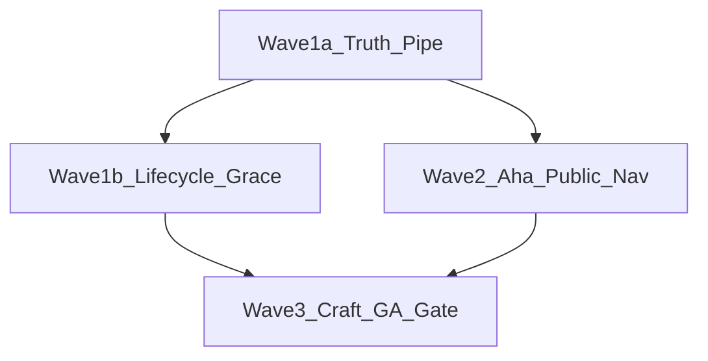

# Public GA Shippable Program — Product Requirements (Design Spec)

**Date:** 2026-07-10  
**Status:** Amended (post code-review) — ready for implementation planning  
**Source:** [Web Services Quality Audit](../../audits/2026-07-09-web-services-quality-audit.md) + product decisions + adversarial review  
**Bar:** Vercel/Stripe — truthful marketing, frictionless self-serve, obsessive craft, productized edge cases  

---

## 1. Summary

Ship PropertyPro as **Public GA self-serve** for **self-managed Florida condo (§718) and HOA (§720) communities**, with a seamless path:

**Signup (card required) → 30-day trial → provision as `root_manager` → compliance readiness win → live public transparency → daily loop → paid conversion (7-day grace → soft lock).**

The **founding account holder is always `root_manager`** (whoever sets up the property). Board members are invited later (designation / resident path) — they are not the self-serve signup actor.

This is a **90-day program PRD** (sequenced waves), not a single feature. Apartments remain available but secondary. PM portfolios stay sales-assisted (“Let’s talk”), not the self-serve hero.

**One-line north star:** A stranger can go from marketing CTA to a live public community URL with a rising compliance score — without human help, false claims, or dead ends.

---

## 2. Goals & non-goals

### Goals

1. **Truth** — Marketing, signup, Stripe, and billing enforcement tell one story.
2. **Activation** — First session produces competence (readiness %) then proof (public URL).
3. **Efficiency** — Slim default nav; one primary action per screen; progressive disclosure.
4. **Seamless recovery** — Every common failure has a branded, reversible path (no Slack/ops dependency for GA paths).
5. **Craft parity** — Everything left in default nav meets the same empty/loading/error/success bar.

### Non-goals (defer post-GA)

- Native iOS/Android / push as launch claims
- Moat features (SIRS lifecycle manager, AI minutes) as launch heroes
- Full PM self-serve portfolio signup
- Making apartments the GTM hero
- Perfect visual unification of marketing `mk-*` vs app shell (token convergence can follow)

---

## 3. Locked product decisions

| Decision | Choice |
|----------|--------|
| Program scope | Full 90-day sequenced program |
| Go/no-go | Public self-serve GA |
| Trial | **30 days**, **card required** at checkout, then charge (code today: 14 days + card already collected; marketing is the lie) |
| Marketing | Must state card required + 30-day trial; **never** “no card required” |
| Founding actor | **`root_manager`** — whoever sets up the account/property (provisioning already inserts this) |
| Primary GTM | Self-managed condo/HOA (single community); board members invited after |
| Apartments | Available in signup; secondary GTM/onboarding |
| PM | Contact sales / not self-serve GA hero |
| Post-trial / payment fail | **7-day grace**, then **soft lock** (mutation-scoped read-mostly + billing CTA) |
| Nav doctrine | **Slim first**, then polish everything that remains visible; **nav = role × community type × plan** |
| Packages/Visitors on condo | **No community-features matrix change.** Stay plan-gated (Professional+). Demote to More for GA slim — do not fight `condo_718` flags with one-off nav hacks |
| Public routes | **Deprecate path `(public)/[subdomain]` for GA**; invest in host rewrite → `/public-site` + empty/error states |
| Transparency aha | **Must not be a settings hunt** — default-on at provision for condo/HOA **or** one-click enable inside aha (today `transparency_enabled` defaults `false` and provisioning never sets it) |
| First-session aha | **Readiness win → guided go-public** (same onboarding arc) |

---

## 4. UX psychology & efficiency principles

These are requirements, not vibes. Every wave must satisfy them.

| Principle | Product rule |
|-----------|--------------|
| **Competence before complexity** | First session must change a visible readiness metric before asking for units/invites sprawl. |
| **Goal gradient** | Show progress (readiness %, checklist steps that map to the aha — not busywork). |
| **One job per screen** | Primary CTA only; secondary actions visually quieter. |
| **Progressive disclosure** | Default nav = board job set; advanced tools behind More / Settings / plan gates. |
| **Peak-end** | End first session on public URL preview (“your community is live”) — memorable peak. |
| **Error as guidance** | Failures name the next action (“Resend verification”, “Return to checkout”, “Update card”) — never raw IDs alone. |
| **Recognition over recall** | Palette/nav only list live routes; no orphan discovery. |
| **Trust consistency** | Same trial length, card policy, and grace rules in marketing, checkout, emails, and in-app banners. |

---

## 5. Personas & jobs

### Primary — Founding admin (`root_manager`)

**Who:** The person who signs up and pays. Provisioning inserts `user_roles.role = 'root_manager'` (`provisioning-service.ts`, creator-is-root). Stale comments saying `pm_admin` are legacy wording — **v3 role is `root_manager`.**

**Jobs:** Get the community compliant, prove it publicly, invite board/residents, keep notices/docs current, manage billing.

**Default nav craft bar = intersection of role × community type × plan** (via existing `getEffectiveFeatures` + `nav-config`). Do not polish Professional-only destinations as Essentials GA requirements.

**Essentials GA default nav (must polish):**

- Dashboard (aha-oriented)
- Documents, Meetings, Announcements
- Compliance
- Residents / units (admin)
- Website / site editor (if shown for plan)
- Settings, Help, Billing

**Professional+ may additionally show (polish if visible):** Operations hub, Violations/ARC, Payments/assessments, Packages/Visitors (condo type allows; keep plan-gated — demote to More if slim requires).

**Out of default nav (More / deep-link / later):** elections, e-sign, accounting connectors, contracts, emergency (unless already critical), PM portfolio chrome that distracts from single-community aha.

**Essentials `maxAdmins: 3`:** Inviting a full board can hit the cap (founder + 2). First-session “invite board” must either stop at cap with a clear upsell to Professional, or not require >2 invites for aha. **Do not silently fail invites.**

### Secondary — Invited board (designation) / resident

**Jobs:** Read docs/notices, light governance, pay, submit maintenance (if plan). Different checklist today (`BOARD_MEMBER_ITEMS` / `OWNER_TENANT_ITEMS`) — aha journey is **not** required for them in Wave 2; founder aha is.

**Default nav:** Slim resident/board pack; no Professional-only items on Essentials.

### Tertiary — Apartment operator

Signup path exists; onboarding stays ops-oriented but **must not** dilute condo/HOA GA messaging.

### Out of Public GA self-serve hero — PM portfolio

Keep marketing PM tier + mailto/sales. Founding `root_manager` may see PM nav affordances — **do not make portfolio setup part of first-session aha.**

---

## 6. End-to-end journey map

```text
Marketing (truthful trial/card)
  → Signup (community + plan)
  → Email verify (resilient retries)
  → Stripe Embedded Checkout (card + 30-day trial)
  → Provisioning progress (recoverable)
  → Magic-link / login as root_manager → Condo wizard (profile + compliance preview)
  → First-session guided aha:
        1) Link/upload required record → readiness % moves
        2) Transparency on (default or one-click) → open live host URL
  → Daily loop (docs, meetings, announcements, compliance queue)
  → Optional: invite board (respect Essentials maxAdmins: 3)
  → Day 30 charge → active
  → If fail/cancel: 7-day grace (full use + banners) → soft lock (mutations)
```

### Current code baseline (must change where noted)

| Area | Today | Target |
|------|-------|--------|
| Trial days | `trial_period_days: 14` | **30** (small change) |
| Card | Collected at Embedded Checkout | Keep; **fix marketing** |
| Marketing copy | “14-day… no card required” | **30-day trial · card required** |
| Founding role | `root_manager` | **Keep** — GA actor |
| Cancel grace | Email 30-day; guard hard-locks `canceled` immediately | **7-day grace then soft lock** |
| `past_due` | Mutations allowed; banner only | Align with grace policy |
| Guard coverage | ~17 `route.ts` files call subscription guard; many mutations unguarded | Inventory exempt vs must-guard |
| Parallel lifecycles | `subscriptionStatus`, `free_access_expires_at`, demo `trial_ends_at` | Map/reconcile before grace |
| Onboarding | Wizard + checklist | **Readiness → public** |
| Transparency | `transparency_enabled` default **false**; provision never sets | Default-on or one-click in aha |
| Public site | Host → `/public-site`; path `[subdomain]` still exists | **Deprecate path routes for GA** |
| `/login` | Broken | Redirect → `/auth/login` |
| Registry | Orphans | Fix or delete |

---

## 7. Requirements by wave

### Wave 1 — Trust & activation continuity (Days 0–30)

**Outcome:** A prospect can pay, provision, and log in without false advertising or dead URLs.

Split to avoid lifecycle thrash:

#### Wave 1a — Truth & pipe (ship first)

##### 1.1 Marketing & legal truth

- Update hero, pricing, FAQ, and email templates: **30-day trial, card required to start**.
- Remove or label unverifiable “Trusted by” logos.
- Mobile copy = “mobile web portal” only.

##### 1.2 Stripe trial = 30 days

- Set `trial_period_days: 30` on signup Checkout (one-constant + copy; low risk).
- Staging E2E: card test → `trialing` → community Stripe IDs set.

##### 1.3 Auth URL hygiene

- Permanent redirect `/login` → `/auth/login` (preserve query).
- Audit emails/templates for `/login`.

##### 1.4 Checkout & provisioning recovery

| Edge case | Required behavior |
|-----------|-------------------|
| Missing `signupRequestId` | Branded empty state + CTA back to signup |
| Email verify expired / resent | Same `signupRequestId`; no duplicate subdomain claim |
| Double-submit signup | Idempotent pending row / clear user message |
| Checkout abandoned | Resume with same id |
| Stripe session expired | Restart checkout without re-entering community data |
| Webhook delayed | Honest polling; no fake success |
| Provisioning step fails | Retryable job + support code |
| Magic link consumed | Password login / resend |
| `www` dashboard bookmark | Explain → tenant host or picker |
| Subdomain taken between verify and checkout | Clear conflict + alternate slug |

##### 1.5 Discovery hygiene

- Fix or remove registry orphans (`/calendar`, `/voting`, `/community-board`, `/arc` → `/arc-requests`, `/polls/new`, `/settings/community`).
- Palette = live routes only.
- Guard `pdfjs-test` / `dev/*` from production.

**Wave 1a exit:** Staging E2E signup→trialing→login; marketing copy clean; orphans gone; `/login` redirect live.

#### Wave 1b — Access lifecycle (after 1a)

##### 1.6 Reconcile existing lifecycles (required before new grace)

Inventory and document how these three interact — **do not add a fourth parallel mechanism**:

1. **`subscriptionStatus` + `requireActiveSubscriptionForMutation`** (~17 route files today; many mutations unguarded)
2. **`free_access_expires_at`** (platform access plans override)
3. **Demo `trial_ends_at` / `assertNotDemoGrace`** (`demo-grace-guard.ts` — demo communities only)

Deliverable: a short matrix (status × demo/non-demo × free_access) and an **allow/deny inventory** of mutation routes: intentionally exempt vs must-guard for GA.

##### 1.7 Paid-community grace + soft lock

- Prefer **`grace_until` timestamp** (or derive from `canceled_at` / trial end + 7 days) consumed by the **existing** subscription guard — not a new `grace_exhausted` enum soup.
- Soft lock = **mutation-scoped** (reads stay available unless a specific route must hide). Writes blocked except billing, profile, support, and aha-critical compliance doc link/upload during grace.
- Align cancel/dunning **emails** to 7-day grace (replace 30-day fiction).
- Extend guard only to routes marked must-guard in the inventory — **no blanket spray**.

**Wave 1b exit:** Documented lifecycle matrix; grace behavior matches emails; guarded set reviewed; integration tests for cancel→grace→lock.

---

### Wave 2 — First-session aha & public wedge (Days 31–60)

**Outcome:** Founding `root_manager` reaches readiness movement + live public proof in one sitting.

#### 2.1 Slim default nav (`root_manager` / invited roles)

- Apply §5 packs; **plan intersection is mandatory** (Essentials ≠ Professional craft list).
- Packages/Visitors: leave `community-features` alone; demote via More when Professional + condo would clutter aha.
- Tests: `nav-config` snapshots per role × type × plan.

#### 2.2 Onboarding arc (psychology)

Replace checklist primacy with **guided aha** for founding `root_manager`:

1. **Land** on compliance-oriented home (not a wall of setup chores).
2. **Action 1:** Link or upload one required record → readiness % updates.
3. **Action 2:** Transparency available without settings archaeology → open **host** URL (`{slug}.getpropertypro.com/…`) in a success panel.
4. Remaining setup (units, invites, announcement) = optional “Strengthen” after aha — invites must respect **`maxAdmins: 3`** on Essentials.

Condo wizard stays pre-dashboard; do not add a third competing checklist system.

#### 2.3 Public site reliability

- **Deprecate** path-based `(public)/[subdomain]` for GA traffic; host rewrite → `/public-site` is canonical.
- Production: tenant DNS / Vercel for `*.getpropertypro.com`.
- Empty transparency: intentional empty state — never generic 500.
- Staging playbook without relying on `*.localhost` (router ignores localhost subdomains by design).

#### 2.4 Help & context

- Help community-scoped when authenticated.
- Contextual help from compliance / documents.

**Wave 2 exit:** Scripted first-session (`root_manager`, Essentials) completes readiness + public host URL under 15 minutes on staging; transparency not default-off trap.

---

### Wave 3 — Craft parity & GA gate (Days 61–90)

**Outcome:** Every default-nav destination is frictionless; dunning/soft-lock feels fair; go/no-go measurable.

#### 3.1 Surface craft pass (default nav only)

For each **visible** nav destination after slim + plan gate: loading skeleton, empty state, error recovery, success toast, mobile-acceptable layout.

**Essentials priority:** Compliance → Documents → Meetings → Announcements → Residents → Settings/Billing → Help → Website.

**Professional+ add:** Operations → Violations/ARC → Payments → (Packages/Visitors if not demoted).

#### 3.2 Soft lock & dunning UX

- Banners: trialing (days left), grace, soft-locked.
- Billing portal always reachable in grace/lock.
- Soft lock = mutation-scoped per §8; compliance doc writes allowed during grace if needed to finish aha.
- Emails match 7-day grace.

#### 3.3 Mobile web

- Treat `/mobile` as responsive portal; session-stable deep links; no “Coming soon” dead rows without href plan.
- Same aha CTAs reachable on small viewports.

#### 3.4 Apartment secondary path

- Signup still offers Apartment; post-provision uses apartment dashboard/checklist.
- Marketing homepage remains board/compliance-first; apartment not in hero claims.

#### 3.5 GA go/no-go checklist

- [ ] Marketing ↔ Stripe ↔ emails consistent (30-day, card required, 7-day grace)
- [ ] Lifecycle matrix documented (subscription / free_access / demo grace)
- [ ] Mutation guard inventory (exempt vs must-guard) reviewed
- [ ] Signup→provision→aha E2E as `root_manager` on Essentials (staging + one prod smoke)
- [ ] Public **host** transparency loads (empty + populated); path `[subdomain]` deprecated for GA
- [ ] Zero orphan registry/nav links
- [ ] Soft lock enforced on must-guard mutations + UI
- [ ] `/login` redirect
- [ ] Default nav slim + Essentials craft pass signed off
- [ ] `maxAdmins: 3` invite UX verified
- [ ] Tenant isolation regression still green
- [ ] Support runbook for stuck provisioning / payment

**Wave 3 exit:** Checklist complete → Public GA.

---

## 8. Billing & access state machine

### 8.1 Three existing mechanisms (must map first)

| Mechanism | Scope | Behavior today |
|-----------|--------|----------------|
| `subscriptionStatus` + `requireActiveSubscriptionForMutation` | Paid communities; **~17 route files** guarded; many mutations **unguarded** | `past_due` allowed; `canceled`/`expired`/`unpaid`/`incomplete_expired` → immediate 403; `null` fail-open; `free_access_expires_at` overrides |
| `free_access_expires_at` | Platform access plans | Overrides locked subscription while in window |
| `demo-grace-guard` / `trial_ends_at` | **Demo** communities only | Blocks writes in demo grace (`DEMO_GRACE_READ_ONLY`) |

**Rule:** Paid GA grace extends mechanism (1) with `grace_until` (or equivalent derivation). Do **not** reuse demo guard for paid. Do **not** invent a fourth status system. Wave 1b includes an inventory of unguarded mutation routes (exempt vs must-guard).

### 8.2 Paid GA effective access

| Condition | UX | Mutations |
|-----------|-----|-----------|
| `trialing` / `active` | Full access; trial banner if trialing | Allowed |
| Within **7-day grace** (`past_due`, trial ended unpaid, or `canceled` with `now < grace_until`) | Full access + urgent banner | Allowed (including compliance doc writes) |
| After grace / soft lock | Reads OK; writes blocked | Blocked except billing, profile, support |
| `free_access_expires_at > now` | Per access plan | Allowed (existing override) |
| Demo community | Unchanged | `assertNotDemoGrace` as today |

### 8.3 Edge cases

- Webhook out of order — idempotent handlers; UI polls source of truth.
- Card update mid-grace — return to `active`/`trialing` without support.
- `incomplete` / `incomplete_expired` — restart checkout path; do not strand user.
- Plan change mid-trial — features follow `subscription_plan`.
- Deletion request during trial — existing lifecycle wins.
- Soft lock during unfinished aha — compliance link/upload remains allowed through grace.

---

## 9. Edge-case catalog (must not ship broken)

### Activation

1. Verify email on second device  
2. User closes tab during Embedded Checkout  
3. Stripe declines card at trial start  
4. Duplicate subdomain race / taken between verify and checkout  
5. Provisioning watchdog timeout  
6. User already has Supabase account from prior attempt  
7. Essentials vs Professional first session (no Professional-only aha steps on $199)

### Session / tenancy

8. Multi-community user, missing `communityId`  
9. Stale cookie on tenant host vs apex  
10. Deep link to demoted feature — soft landing, not 500  
11. Founding `root_manager` vs invited board designation (different checklists)  
12. Essentials **`maxAdmins: 3`** — invite flow hits cap; upsell or stop cleanly  

### Public wedge

13. `transparency_enabled` still false after provision (must not happen post-fix)  
14. No documents published yet — empty state, not 500  
15. Custom domain pending DNS  
16. Unpublished site draft vs live notices  

### Billing

17. Trial ends Friday night — grace messaging clear  
18. Payment fails, user ignores 7 days — soft lock  
19. `incomplete_expired` after failed Checkout  
20. User disputes charge — support runbook  
21. Demo grace vs paid grace — never cross wires  

### Discovery

22. ⌘K for removed/plan-locked item — no hit or upgrade CTA  
23. Old bookmark `/maintenance` → Operations  
24. `/arc` → `/arc-requests`  

---

## 10. Metrics

**Go/no-go is binary journey E2E + checklist (§3.5), not conversion %.** Optional product metrics after instrumentation exists:

| Metric | Note |
|--------|------|
| Signup → payment_completed | Track; no fake gate number until events exist |
| payment_completed → provisioning completed | Target ≥ 98% once measured |
| Session-1 readiness delta / public URL open | Track after aha events shipped |
| Orphan route hits | **0** (hard gate) |

---

## 11. Testing requirements

- **E2E:** signup→verify→checkout(test)→provision→login as `root_manager`→readiness→public **host** URL  
- **E2E:** `/login` redirect; orphan URLs; soft-lock write denied; Essentials nav excludes Professional items  
- **Integration:** webhooks + grace clock; `free_access` override; demo grace unchanged  
- **Unit:** nav packs × plan; guard grace math; single-sourced marketing trial copy  
- **Manual GA gate:** prod smoke on one real tenant host  

No first-party mocks in integration tests (repo rule).

---

## 12. Risks & open engineering notes

| Risk | Mitigation |
|------|------------|
| Soft-lock vs immediate cancel is a behavior change | Same-day email + release note |
| Unguarded mutations | Inventory before spraying guards |
| Three lifecycles already | Map in Wave 1b; no fourth system |
| `*.localhost` cannot demo tenants | Staging host playbook |
| Slim nav / More | Help: “Where did X go?” |
| Craft pass scope creep | Essentials list first; Professional add-ons second |
| `maxAdmins: 3` | Explicit invite UX |

---

## 13. Wave dependency graph



---

## 14. Document control

- **Supersedes for launch sequencing:** July 2026 web-services audit 90-day sketch (this file wins).  
- **Does not replace:** ADR-006, `AGENTS.md` tenant rules, Phase 5 table-stakes specs.  
- **Next step:** Wave 1a implementation plan (then 1b / 2 / 3).

### Amendment log (2026-07-10)

1. Founding actor locked as **`root_manager`**.  
2. Default nav / craft bar **by plan** (Essentials wedge vs Professional+).  
3. Packages/Visitors: no `community-features` fight; plan-gate + More.  
4. Soft lock: mutation-scoped + `grace_until`; reconcile **three** existing lifecycles; inventory unguarded routes (~17 guarded route files, not “44 rewires”).  
5. Transparency: default-on or one-click (high priority — schema default false).  
6. Public routes: **deprecate** path `[subdomain]` for GA.  
7. Wave 1 split into **1a / 1b**.  
8. Edge cases: `maxAdmins: 3`, Essentials aha, `incomplete_expired`, demo vs paid grace.  
9. Metrics demoted from fake gates to track-after-instrument.

---

## 15. Acceptance of this PRD

Approve if:

1. `root_manager` founding path + Essentials-first nav + 30-day card trial + 7-day grace soft lock matches intent  
2. Slim-then-polish + readiness→public aha matches UX goals without bloat  
3. Lifecycle reconciliation + guard inventory are explicit Wave 1b work  

Request changes inline; implementation planning starts only after acceptance.
